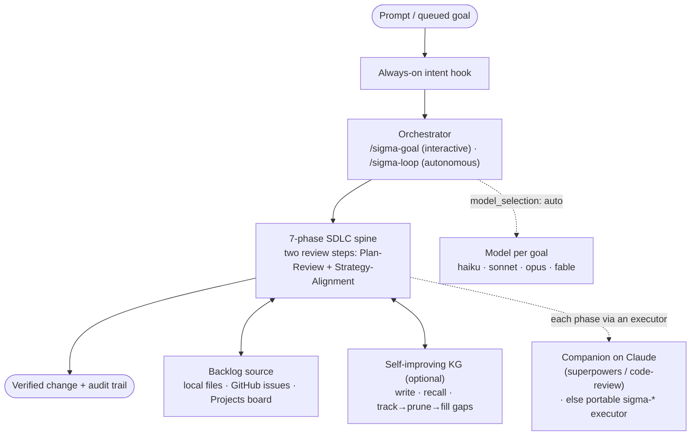
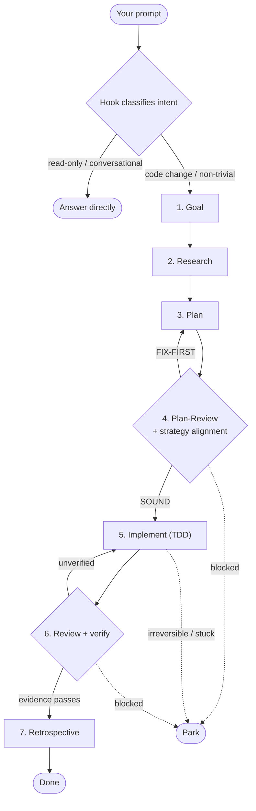
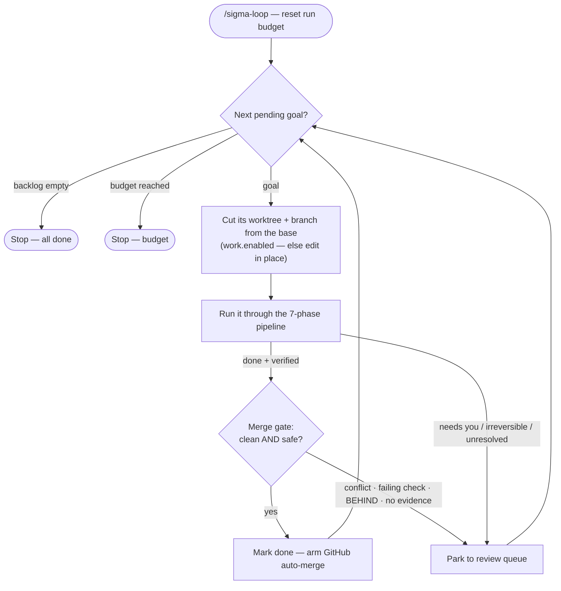

# Sigma Loop

## Privacy

Sigma Loop does not report usage data. Its measured egress behavior, opt-in integrations, local data, and capture limits are documented in [docs/privacy.md](docs/privacy.md).

[](https://github.com/Agrim-Intelligence/sigmaloop/actions/workflows/ci.yml)

To remove Sigma Loop from a repository, follow the read-only verified [uninstall guide](docs/uninstall.md).

CI runs the full suite on Linux with Python 3.10, 3.11, 3.12, and 3.13, and on macOS with Python 3.12. It does so nightly and on demand (Actions > CI > Run workflow). The one required check, `test`, is a subset (minus the six heaviest drill and audit files) that pull requests and merges to main run on one macOS leg. Windows verification remains an on-demand experimental workflow.

**Guardrails + an overnight autopilot for your AI coding agent — one that plans before it codes, has every plan reviewed against your strategy, and gets sharper every run.**

Drop it into any repo and every non-trivial prompt is asked to follow a disciplined **7-phase SDLC** — Goal →
Research → Plan → Plan-Review → Implement → Review → Retrospective — so the agent stops jumping
straight to code. In the autonomous loop that is **checked, not just asked**: `loop.py record done` is
refused until the action log shows research, plan, an approved plan-review, implement (started after it),
an approved independent review and retro (`gates.phase_record`, on in a fresh `/sigma-init`; what the record
does and does not prove is in [docs/enforcement.md](docs/enforcement.md)). Then queue a backlog and let it **run autonomously**: each goal is driven to a
*verified* finish, moved across a **GitHub Projects board**, and recorded with a full audit trail.
Start from an existing repo **or** a product vision; Sigma Loop grounds the work in your strategy and
remembers what it learns in a **self-improving knowledge graph**.

> ### ⚠️ Running an older plugin? Update before you start the loop
>
> If the installed Sigma plugin is older than 1.0.0, **do not run the loop until you have updated.**
> That floor is the one `AGENTS.md` states and `/sigma-doctor` enforces; it never sits above the
> version `.claude-plugin/plugin.json` ships. Mixed versions writing `sdlc:*` labels on one board is
> the one configuration to avoid.
>
> ```bash
> claude plugin update sigmaloop@sigmaloop   # upgrades an installed plugin (the full plugin@marketplace id)
> # then RESTART the session — the version in use is resolved at session start
> /sigma-doctor                      # reports your installed version vs the marketplace's
> ```
>
> `claude plugin marketplace update sigmaloop` only refreshes the marketplace listing, and
> `claude plugin install` on an installed plugin is a no-op; neither upgrades it.

> **One promise: best-quality output, minimum effort.** Zero runtime deps (bash + python3 stdlib) and
> **zero hard plugin dependencies** — it installs seamlessly with or without anything else. If the
> `superpowers` + `code-review` companions are **already installed**, Sigma uses them
> automatically; if not, the portable `sigma-*` executors run the same phases — **you install
> nothing**, on any host.

---

## Two ways to run: interactive or autonomous

Both modes drive the **same seven phases** per goal — they differ in who's in the loop and what
happens at a checkpoint. The repo-scoped prompt hook underpins both.

### `/sigma-goal <goal>` — interactive

One goal through the engine, **pausing for your approval at each gate**. Take a goal from
`.sdlc/goals/` (preferred — so it's tracked) or inline text, then walk Goal → Research → Plan →
**Plan-Review** (via `sigma-plan-review`; recorded, and the loop refuses `done` without it) → Implement (test-first) → Review (evidence
before "done"). It does **not** auto-proceed past checkpoints — you approve each one. The outcome is
recorded to `.sdlc/` (`done`, or `parked` with a reason) so it shows in `/sigma-status`.

### `/sigma-loop` — autonomous

Pulls the backlog — local `.sdlc/goals/` files or [GitHub issues](#your-backlog-local-files-or-github-issues) —
and runs **each goal autonomously** through the same phases, one dispatched subagent per phase, each bracketed
by `phase_report.py` (banner and cost line) and recorded in the action log; `loop.py phases <dir> <goal>` shows
what is recorded and the next step. A trivial goal can waive research and retro only
(`loop.py waive-phases`, recorded and visible); more phases mean more spend, so measure it on your own goals. Anything
that needs a human is **parked to `.sdlc/state/review-queue.md`** and the loop continues — it parks,
it does not force. It parks on:

- a hard checkpoint / a decision only you can make,
- an **irreversible or expensive action** (deploy, delete, overwrite, spend, migrate) — its
  instructions ask the agent to park it rather than run it unattended (advice: no code reads `gates.irreversible_actions`;
  that advice is about the agent, and two things Sigma's own code does are outside it because each is bounded by
  construction: the lease-protected force-push of a unit branch, and, only once you enable upkeep, the removal of old
  backup refs under Sigma's own backup namespace; see `docs/branching-model.md` section 13b),
  unless you opted in (`spend_approval`, off by default) and wrote a single-use
  `sigma:spend-approved=<label>` line as the first line of that goal's issue body, which
  `loop.py spend-approval` checks, audits and then honours once (a per-use go-ahead, not a spend cap; the check is on who opened the issue, so any repo writer could add the marker to it),
- a hard failure it cannot resolve — recorded as **`failed`** (needs a fix), distinct from
  parked (needs a decision), so the review queue separates the two.

It halts on the **per-run budgets** (`config.json` → `budget`) — `max_iterations`, `max_minutes`
(wall-clock from the run's start), `max_tokens` (cost-equivalent tokens from fully priced Claude
phase reports or explicit `loop.py spend`), and `max_codex_raw_tokens` (measured Codex phase input
+ output tokens, including cached input). The two token counters use different units and never
mix. Codex's token ceiling is a **phase-boundary admission stop**, not a quota or billing cap: it
checks the next pick after measured phases finish and does not include orchestrator or unmeasured
turns. Keep `max_minutes` and a goal-count ceiling for those gaps. Each key enforces only when set;
an absent/zero key enforces nothing. When a Claude model is absent from the rate card, every phase
end warns that `max_tokens` did not count its turns and `/sigma-doctor` reports the same coverage
gap. Independently,
a NEW `handoff.after_goals` ceiling (default 20, ON even when the
key is absent — see `config.json.tmpl`) stops the ORCHESTRATING session itself after that many
goals and hands off to a fresh one, so its own context never keeps growing across an unattended
drain; `enabled: false` opts back into the old behaviour. Goal-count limits retain their count
throughout one session, including refills; a new session resets them. A stopped run is
resume-safe (a budget stop, re-run, picks up
where it left off).
**Overnight without babysitting:** `python3 <installed-sigma>/skills/sigma-loop/scripts/supervise_daemon.py .sdlc` wraps the
loop in a zero-polling supervisor — blocked while a session runs, and on exit it classifies the
tail: loop finished → stop; per-run budget → relaunch; **usage-limit exhaustion → sleeps until the
stated reset time (+ jitter) and relaunches**; unknown crash → capped escalating backoff. Stop it
any time with `touch .sdlc/state/supervisor.stop`. (Sleeping *machine* ≠ sleeping process — on a
macOS laptop run it under `caffeinate -is`.)
For Codex, follow the [Codex-only opt-in migration](docs/codex-autonomy.md) first; it verifies the enabled
Codex plugin and launches a fresh Codex session without changing Claude's installation.
Run **`/sigma-status`** any time for backlog counts (pending / in-progress / done / parked / failed) + whether the
review queue needs attention.

| | `/sigma-goal` (interactive) | `/sigma-loop` (autonomous) |
|---|---|---|
| Scope | one goal | the whole `.sdlc/goals/` backlog |
| At a checkpoint | pauses for you | parks to the review queue, continues |
| Approval | every gate | only what it parks |
| Stops on | goal complete / you stop | backlog empty, per-run budget, or a context hand-off (then resumes fresh) |
| Context bounded across goals | not yet — see issue tracker for the follow-up | goal count capped at 20 per session by default (`handoff.after_goals`); post-change token measurement pending |
| Irreversible action | asks you | asks the agent to park it (advice; no code check) |

`/sigma-goal` claims its own named goal directly and is not driven by `loop.py next`/`next-batch`,
so the hand-off ceiling above does not reach it — a human re-running `/sigma-goal` many times in one
long conversation can still grow that conversation's context unbounded. Tracked separately, since
`/sigma-goal`'s own approval-gated, single-goal design needs a different answer than an autonomous
loop's does, not merely the same mechanism wired in.

---

## The seven phases

Each phase runs via an **executor**, resolved per host: on Claude with the companion installed, the
`superpowers` / `code-review` skill; otherwise Sigma's **portable `sigma-*` executor** — each with a
committed [parity review](docs/executor-parity/) showing where it is at par, better or lighter. Phase 4 is always
Sigma's own; no companion ships it.

1. **Goal** — restate the objective as one concrete, checkable goal. For feature/creative work, this
   is where you explore intent and requirements first.
   → *executor:* `superpowers:brainstorming` · portable `sigma-brainstorm`.
2. **Research** — map the blast radius: affected files, existing patterns, constraints, prior art —
   then size the goal into a lane (`small`/`medium`/`large`) from what was actually measured, so small
   goals skip the ceremony they don't earn.
   → *executor:* **`sigma-research`** (always Sigma's own — no companion equivalent).
3. **Plan** — write the plan: steps, files, tests, and a definition-of-done. Size it against real
   throughput with **`/sigma-velocity`** (measured git pace), not "this feels like weeks."
   → *executor:* `superpowers:writing-plans` · portable `sigma-plan`.
4. **Plan-Review** — adversarially review the plan **before** any edit: verify each claim against the
   real code, stress-test what breaks after it ships, check scope/fit, and (vision-first) check it
   against your strategy. The skills ask the agent never to skip it. In the loop it is also checked: `gates.phase_record` (on in a fresh `/sigma-init`) makes `loop.py record done` and `work.py merge` refuse a goal with no approved plan-review (recorded through `work.py record-plan-review`, which binds it to the exact plan bytes; the gate needs `action_log.enabled`), and the opt-in `gates.plan_review.enabled` (off by default; needs `work.enabled`) additionally refuses the push in `work.py pr`. Interactive work that never calls `record done` or `work.py merge` is asked, not gated; the record is agent-written, so it proves a verdict was recorded, not who reviewed. This is the step `superpowers` doesn't provide, so Sigma
   ships it.
   → *owned by* **`sigma-plan-review`** (always Sigma's — no companion equivalent).
5. **Implement** — build test-first and execute the plan step by step.
   → *executor:* `superpowers:test-driven-development` + `executing-plans` · portable `sigma-implement`.
6. **Review** — code-review the diff for real findings, then verify every claim with evidence before
   declaring anything done.
   → *executor:* `code-review` + `superpowers:requesting-code-review` + `verification-before-completion`
   · portable `sigma-review` + `sigma-verify`.
7. **Retrospective** — surface the structural + product debt the fix left behind, grade
   intent-vs-shipped, and route each durable lesson to the right store (advisory).
   → *executor:* **`sigma-retro`** (always Sigma's own — no companion equivalent).

---

## Quickstart

One placeholder stands in for a path on this page. `<installed-sigma>` is the directory Sigma Loop's scripts
live in on your machine: the plugin directory your host shows for the installed `sigma-init` skill (Claude Code,
Codex), or your Sigma Loop checkout (Cursor). Every `python3 <installed-sigma>/...` command on this page is run
from the root of your repository, where `.sdlc/` lives. Every install line below uses the public repository,
`https://github.com/Agrim-Intelligence/sigmaloop`.

The marketplace that repository adds is named `sigmaloop`, so the plugin id is `sigmaloop@sigmaloop` on Claude
Code and on Codex (the Claude Code install was measured in an isolated profile for this name, see
[docs/onboarding-control.md](docs/onboarding-control.md); Codex was last measured under the previous plugin id and
has not been re-run for this one).

### Claude Code

Inside a Claude Code / Claude Desktop session:

```
/plugin marketplace add https://github.com/Agrim-Intelligence/sigmaloop
/plugin install sigmaloop@sigmaloop
```

Or from a terminal (the same two commands in CLI form, useful for a setup script):

```
claude plugin marketplace add https://github.com/Agrim-Intelligence/sigmaloop
claude plugin install sigmaloop@sigmaloop
```

Restart the session, then, from the root of the repository you want Sigma to work on:

```
/sigma-init --demo     # checks access, asks mode + verify command, scaffolds .sdlc/, queues a demo goal
/sigma-loop            # runs the demo goal Goal → Research → … → Review
```

### Codex

```
codex plugin marketplace add https://github.com/Agrim-Intelligence/sigmaloop
codex plugin add sigmaloop@sigmaloop
```

Codex reads the same `.claude-plugin/marketplace.json`: Sigma Loop ships no other manifest. On
2026-10-08 the marketplace URL and plugin id were tested in an isolated `CODEX_HOME` against the
1.0.3 feature branch; the enabled inventory and installed skill resolved to the same clean commit.
A full Codex goal-to-merge run has not yet been measured. Then run
the `sigma-init` skill, or its flow directly, with `--codex` so `AGENTS.md` carries the standing rules
([details](#codex-partial-live-validation)):

```
python3 <installed-sigma>/skills/sigma-init/scripts/init_flow.py . --codex --demo
```

### Cursor

Sigma ships no Cursor plugin manifest, so on Cursor it runs from a checkout, and `<installed-sigma>`
is that checkout (whether Cursor's own plugin support could install Sigma is unverified)
([details](#cursor-experimental)):

```
git clone https://github.com/Agrim-Intelligence/sigmaloop <installed-sigma>
python3 <installed-sigma>/skills/sigma-init/scripts/init_flow.py . --cursor --demo
```

### The next step is `/sigma-init`

Run **`/sigma-init`** first, in every repository, on every host. It is the one command, and it is
safe to re-run: it does not ask an answered question again, and it never changes a setting in
`.sdlc/config.json` unless you pass the flag for it on that run.

- **`/sigma-init`** checks git and `gh` access, asks the backlog mode and the verify command, and in
  github mode creates the `sdlc:*` labels, scopes discovery to `@me` and offers a board and the
  ledger. It scaffolds `.sdlc/` and git-ignores its runtime directories. It ends with the next
  command to run.
- **`/sigma-setup`** is an alias: it runs the same flow.

On Codex and Cursor there is no interactive question: the flow prints each open one as an `[ask]`
line with the flag that answers it (`--mode`, `--verify`, `--board`, `--ledger`, `--local-only`),
and `--yes` takes the safe defaults (the detected mode, ledger off; never a board, a verify command
or a work flip) for questions `.sdlc/config.json` does not already answer.

### What `/sigma-init` will ask you

- **Mode.** Local goal files in `.sdlc/goals/` (`--mode local-goals`) or GitHub issues labelled
  `sdlc:goal` (`--mode github`; the default when `origin` is a GitHub repository). The scaffolded
  example goal ships `status: proposed`, so nothing is picked until you queue a goal or pass
  `--demo`. Flags add to that: `--vision` to start from a product vision, `--demo` to queue a demo
  goal, `--codex` / `--cursor` for those hosts' standing rules. A PR per goal
  (`work.enabled`) is on by default. If this repository has no usable remote, init prints a
  DECISION: add the remote, use another existing remote, or go local-only (the loop then edits this
  checkout directly, with no worktree, branch, push or PR; `--local-only`). Nothing is flipped for
  you.
- **Board.** Github mode creates the `sdlc:*` and `priority:P0`–`P3` labels on the repository, then
  OFFERS a Projects board and creates nothing unless you say yes (`--board yes`):
  `board_setup.py create` makes `<repo> — SDLC` with Status and Priority, links it and pins
  `project.number` ([board](skills/sigma-init/references/board.md)). Or point `project.number` at an
  existing board. `--github` also copies issue templates, an auto-add-to-project workflow and a
  label guide into `.github/`.
- **Verify command.** Init lists the test commands it detects, each with a number and an id. Confirm
  one, give your own, or decline. Confirming turns `verify.enforce` on; declining leaves it off and
  records why. With enforce off and no command there is nothing to prove, so nothing demands verify
  evidence: `record done` and, in github mode, the PR merge still pass their other gates (review,
  CI, done-means-merged). The gestures, with `<n>` and `<id>` copied from the printed list (init
  prints them with both paths already filled in):

  ```
  python3 <installed-sigma>/skills/sigma-init/scripts/verify_detect.py confirm .sdlc <n> <id>
  python3 <installed-sigma>/skills/sigma-init/scripts/verify_detect.py set .sdlc --command-file <file>
  python3 <installed-sigma>/skills/sigma-init/scripts/verify_detect.py decline .sdlc
  ```

- **Access.** Init checks, before the loop needs them: a git repository, the `origin` remote, the
  base branch pushed there, `gh` installed, `gh auth status`, and the token's scopes (`repo`;
  `workflow` when work is on; `read:org` when the owner is an organization; `project` when a board is
  on). A directory that is not a git repository is refused before anything is written. Re-run the
  check any time:

  ```
  python3 <installed-sigma>/skills/sigma-init/scripts/preflight.py check . --sdlc .sdlc
  ```

Run these from the root of your repository (the [Quickstart](#quickstart) defines
`<installed-sigma>`); inside a Claude Code session the skill runs them for you.

### If `/sigma-init` says you lack access

Each `[FAIL]` or `[CANNOT VERIFY]` line prints its own fix. These are the commands it prints, with
your host and base branch filled in; run them from the root of your repository. `gh auth login` and
`gh auth refresh` are interactive, so run them yourself; Sigma never runs them for you.

| Init reports | Run |
|---|---|
| not inside a git repository | `git init` then `git commit --allow-empty -m "initial commit"` |
| no commit yet | `git commit --allow-empty -m "initial commit"` |
| no remote named `origin` | `git remote add origin <url-of-your-repository>` |
| base branch not on the remote | `git push -u origin <base>` |
| `gh` not installed | install it from https://cli.github.com, then re-run the check |
| gh not logged in | `gh auth login -h github.com -s repo,workflow,read:org` |
| token missing scopes | `gh auth refresh -s <missing scopes> -h github.com` |
| a fine-grained token (scopes cannot be read) | `gh auth login -h github.com -s <required scopes>` |
| you want another remote | `python3 <installed-sigma>/skills/sigma-init/scripts/preflight.py use-remote .sdlc <remote>` |
| no GitHub remote at all, and you want to go on without one | `python3 <installed-sigma>/skills/sigma-init/scripts/preflight.py local-only .sdlc` |

`<required scopes>` is the list init prints for this repository, by the rule under **Access** above
(for example `repo,workflow,read:org` for an organization's repository with work on). A fine-grained
token has no scopes to read, so init names the permissions it needs instead: Contents, Pull requests
and Workflows write, plus Projects write when a board is on and access to the organization when
the owner is one.

If your organization enforces SAML SSO, the scopes line also names the token settings page where
you authorize the token for it.

### Adopting into an existing repo

For a real project (existing code, a GitHub board, a team), run `/sigma-init` (or its alias
`/sigma-setup`) in github mode:

```
/sigma-init --mode github --ledger yes
```

It writes a config scoped to **your own issues (`@me`), with a PR per goal**, **creates the core
`sdlc:*` lifecycle labels on the repo** so nothing is left configured but unpickable, and prints the
ledger's bootstrap line (it pushes an ops branch, so you run it). It deliberately avoids three traps
real adoptions hit: it never enables `verify.enforce` without a real `verify.command` (that refuses
every `done` forever); it never clobbers or narrows a git-ignore rule you already set (pass
`--ignore-scope local` to keep the repo's tracked files untouched); and label creation never
recolours an existing label or applies a label to any issue — deciding which
issues become pickable stays a deliberate, separate, human triage call. If your repo already gates
source edits behind its own `PreToolUse` hook, note that Sigma's Implement-phase edits go
through it too — make sure whatever it expects is satisfied.

The plugin installs machine-wide, but its hooks only speak in repos that adopted Sigma (the prompt
hook checks for `.sdlc/`; the gates and the setup wizard for `.sdlc/config.json`). If the `superpowers` + `code-review` companions are
**already** in your plugin list, Sigma uses them automatically; if not, the portable `sigma-*`
executors run the same phases ([details](#companions-optional-enhancement)) — **nothing to install
either way**.

See the **[worked walkthrough](examples/hello-sdlc/)** for a runnable end-to-end example.

### Upgrading a repo adopted under the plugin's previous name?

Install Sigma and carry on. Sigma reads the schema ids, markers, environment variables and config
key that the previous name's 1.4.x releases wrote. When you want the files themselves renamed, run
the one-shot migration. It is a dry run by default, `--apply` writes, and it is safe to re-run (a
unit record the old plugin wrote after the conversion is refused and left for
`feature_sync.py repair`; see docs/upgrading.md):

```
python3 <installed-sigma>/skills/sigma-doctor/scripts/migrate.py .sdlc            # lists every change
python3 <installed-sigma>/skills/sigma-doctor/scripts/migrate.py .sdlc --apply    # writes and prints what it changed
```

The old plugin cannot read Sigma's spellings, so migrate once the whole team runs Sigma. See
[docs/upgrading.md](docs/upgrading.md) for what it reads, what it rewrites and what it leaves alone.

Sigma runs fully next to the old plugin and replaces it: nothing is refused while both are
installed, and each run prints one notice naming the uninstall command. Cut over with
[Switching over from the previous plugin](docs/upgrading.md#switching-over-from-the-previous-plugin):
install Sigma, run it, **stop the old plugin on the repository**, migrate, then uninstall it. The
old plugin cannot read Sigma's registry, so `--apply` waits for that step (or for an explicit
`--replace-old-plugin`).

---

## What you get

Every option Sigma provides, at a glance. Rows that name a control link to [docs/enforcement.md](docs/enforcement.md), the generated table of what actually holds each one (a Python gate, the git host, a Claude Code hook, or advice the agent is asked to follow) and on which hosts:

| Capability | What it gives you | Command / component |
|---|---|---|
| **Repo-scoped SDLC reminder** | On Claude Code, the prompt hook asks the agent to follow the 7-phase spine; Codex and Cursor read the same standing rule from an opt-in scaffolded file (`AGENTS.md` via `--codex`, `.cursor/rules/sdlc.mdc` via `--cursor`) | `hooks/sigma_gate.sh`, `/sigma-init --codex` / `--cursor` · [enforcement](docs/enforcement.md) |
| **Plan review before any edit** | Asks the agent to have the plan adversarially reviewed *before* any edit — the step `superpowers` doesn't ship. **Gated in the loop, not in interactive use:** `gates.phase_record` (on in a fresh `/sigma-init`) makes `loop.py record done` and `work.py merge` refuse without an approving verdict bound to the plan's bytes; work that never calls them is not gated. **Further opt-in gate** (`gates.plan_review.enabled`, off by default): `work.py pr` refuses to push, on every host, unless `work.py record-plan-review` recorded an approving verdict for the exact plan bytes on the branch — checked at `work.py pr`'s push only (not the first edit, not a later rebase force-push); the record is agent-written, so it proves a verdict was recorded, not who reviewed. With `gates.phase_record` off or absent and this gate off, nothing in code verifies it ran | `sigma-plan-review`, `work.py record-plan-review` · [enforcement](docs/enforcement.md) |
| **Strategy-alignment check** | Asks the plan reviewer to send back (FIX-FIRST) a plan that contradicts your stated strategy / non-goals | `sigma-plan-review` + north-star · [enforcement](docs/enforcement.md) |
| **Two ways to start** | **Drop-in** (existing repo) or **vision-first** (start from a product vision) | `/sigma-init`, `/sigma-vision` |
| **One-command adoption** | Detects the repo + board, scaffolds `.sdlc/`, writes a safe config (github discovery scoped to `@me`, ledger on, PRs on) and creates the core `sdlc:*` lifecycle labels — avoiding the verify-trap, never clobbering an ignore rule you already set, and never touching `priority:*` labels or any issue | `/sigma-setup` |
| **Two ways to run** | **Interactive** (approve each gate) or **autonomous** (park-and-continue over a backlog) | `/sigma-goal`, `/sigma-loop` |
| **Hard plan-gate (opt-in)** | With `gates.hard_plan_gate.enabled`, unplanned source is refused at two points. **On every host** (Claude Code, Cursor, Codex): `work.py pr` refuses to PUSH a branch whose goal has no plan under `.sdlc/plans/` — plain Python, and the only enforcement an org lock can rely on. The org-lock lookup behind it is memoised on the goal's work record, so it runs **at most once per goal** however many review cycles `pr` runs through. **On Claude Code additionally**: the `PreToolUse` hook denies the EDIT itself, earlier, when no plan is fresher than `plan_freshness_hours`. Both honour `touch .sdlc/.allow-direct-edits` **only when the key is not org-locked ON** — under an org lock (`.sdlc/managed-settings.json`) the sentinel does not apply at either point and neither refusal offers it — and both skip `.sdlc/`, `docs/` and non-source extensions. A Jupyter notebook counts as source in **both** gates. **With `work.enabled` off** only the hook applies, so the lock is Claude-Code-only there — `/sigma-doctor` and `loop.py record done` say so | `skills/sigma-loop/scripts/work.py`, `hooks/plan_gate.sh` · [enforcement](docs/enforcement.md) |
| **Stop gate (opt-in)** | On Claude Code, with `gates.stop_gate.enabled`, a session can't END with source changed but no fresh plan — the Stop-time counterpart to the plan-gate, so an interactive session doesn't quietly finish unplanned work | `hooks/completion_gate.sh` · [enforcement](docs/enforcement.md) |
| **SessionStart brief (opt-in)** | With `session_start.enabled`, injects the SDLC policy + a doctor-lite install self-check at session start, so the conventions are in context before the first prompt | `hooks/session_start.sh` · [enforcement](docs/enforcement.md) |
| **Machine-checked done** | With `verify.enforce`, "done" is refused until the goal's proving command passes THIS run. On once `/sigma-init` records a confirmed command; never on with an empty one | `loop.py verify` · [enforcement](docs/enforcement.md) |
| **Every phase runs and is recorded** | `loop.py record done` (every mode, local-only included) and `work.py merge` are refused unless the action log shows research, plan, an approved plan-review (bound to the plan's bytes), implement started after it, an approved review (by an agent no other phase used, where the host can spawn subagents), and retro. On in a fresh `/sigma-init` (`gates.phase_record`); an absent key is off. Research and retro can be waived for a trivial goal, recorded and visible. Proves the boundaries and verdicts were recorded, not that the work was good; on a host that cannot spawn a reviewer (route `inline`) the phases are recorded but not proved independent, and `record done` says so | `loop.py phases` · `loop.py waive-phases` · [enforcement](docs/enforcement.md) |
| **Bidirectional report card** | Declare your pipeline's stages once; every stage gets a forward (nothing dropped) + reverse (nothing invented) lane — uninstrumented lanes read ABSENT, never green — with a recurrence delta across runs | `.sdlc/pipeline.json` + `pipeline.py card` |
| **Model + effort auto-selection (opt-in)** | Per-goal ceiling AND per-step downgrade: mechanical steps run on a cheaper tier/effort (`model_selection: "auto"`, default off) | `predict.py resolve / resolve-step` |
| **Findings become work** | The card's failing signals become `proposed` goals (proof-of-fix pre-wired); the loop never runs one until you promote it | `pipeline.py propose` |
| **Team ledger (opt-in)** | A committed, append-only record of what the loop did — **one file per writing process** (so expect many per person), so concurrent appends can't conflict; the team view is their union | `ledger.py`, `ledger.enabled` |
| **Cross-area hand-off** | Blocked on someone else's code? It resolves the owner from CODEOWNERS, opens an issue **assigned to them** (so their loop picks it up), and records it — instead of parking into silence; a marker a human leaves only as a comment (bypassing this) is still caught by the backlog cross-check's own comment fallback | `handoff.py open` / `ack` |
| **Ledger watcher** | Pulls the ledger's own ops branch on an interval — never your working tree — and surfaces what needs you between goals, deduped | `watch_daemon.py`, `sync.py` |
| **Slice parallelism (opt-in)** | Declare a goal's slices and the files each touches; independent ones run as concurrent subagents in **waves** (own worktree each), instead of burning one session's context in sequence | `slices.py plan`, `parallel.enabled` |
| **Goal-level parallelism (opt-in)** | One level up from slices: run MULTIPLE backlog goals concurrently in one session — each its own subagent, worktree, and PR — for one person draining a stack of their own assigned issues | `loop.py next-batch`, `parallel.goals.enabled` |
| **Per-goal worktree (on by default)** | Each goal gets its own worktree + branch + PR, so the loop never moves your checkout and never rewrites `.sdlc/goals/` under itself; cutting fresh from the base **is** the goal-start rebase, so it can't conflict. On by default; `work.enabled: false` turns it off | `work.py start`, `work.enabled` |
| **Rebase & merge, explained** | For a branch you're sitting at yourself: explains what the base did while you were away and why (from CHANGELOG.md, PR descriptions, design docs) before touching anything, flags likely-conflicting files, rebases cleanly — or, on a real conflict, walks you through it file by file with named options (recreate / follow the code's move / abandon / resolve by hand). Once clean, runs this repo's own proving command and, only if it passes and only if you say yes, lands the branch — merge is never automatic | `/sigma-rebase` |
| **Clean-AND-safe auto-merge (opt-in)** | A PR merges only on THIS run's passing verify evidence (whenever verify is required: `verify.enforce` on, or a verify command declared) **plus** GitHub's `mergeable` + `mergeStateStatus CLEAN`, and then lands **directly** with `gh pr merge` — GitHub's own `--auto` is armed only for a required check that has not answered yet; anything else parks with the reason. After landing, the merge reads the issue's own state and **closes it itself** whenever GitHub's own keyword has not already done so, never touching one already closed | `work.py merge`, `work.auto_merge` · [enforcement](docs/enforcement.md) |
| **Done means merged** | A goal is `done` only once its PR has merged. On the shipped defaults (`auto_merge: "off"`) the loop leaves the reviewed PR for a human and records `review`: the issue stays open, still a goal, its card in QC. `record done` is refused while the PR is unmerged, and the merge-reconcile pass (every `next`, the watch tick, or `loop.py reconcile-merges`) records `done` and closes the issue once the PR merges. Its cost, measured: one REST `pulls/<n>` read per waiting goal, at most 10 per pass, and no `gh pr view` (GraphQL) read; closing a goal adds one REST read when the ledger or journal is on, plus issue reads/writes: a cold-cache, board-disabled `GitHubSource.complete()` dispatches five gh commands (one REST issue state probe — since #895, with one `gh issue view` fallback only on rate limit/5xx/transport — one issue close, two GraphQL node/label queries, one GraphQL label mutation), measured with an injected runner, not live quota timing. Board operations, retries and comment fallback add calls. One pass or CLI `record done` runs at a time (a kernel lock), and a goal stuck awaiting merge shows its age in `/sigma-doctor`, `/sigma-status` and `log.py slots` (`awaiting merge for 3d`). The 3-day wait and 1-day successful-read alarms are policy defaults, configurable with `work.merge_stuck_seconds` and `work.merge_unread_seconds`; failed reads do not refresh freshness. Lost merge tracking or disabled work appears blocked in the log. Goals with no PR are unaffected | `loop.py record … review`, `loop.py reconcile-merges` · [enforcement](docs/enforcement.md) |
| **Open-source safe by default** | A fork PR, or a repo you only have read access to, is never merge-attempted — the loop opens the PR, says why it stopped, and records `review` (the goal is done once the upstream merge lands). `auto_merge: "protected"` further limits merging to branches that genuinely require checks or reviews | `work.py merge_rights` / `protection` · [enforcement](docs/enforcement.md) |
| **PR review gate (on by default)** | A real review *after* the PR, independent of branch protection: parks on a Request-changes, an unresolved thread, or a `sigma:block` comment; `"approval"` also needs an approval (formal, or a `sigma:approve` comment — GitHub blocks self-approval). On by default (`"changes"`; `"off"` turns it off), and it runs under every `auto_merge` policy — including the default `off`, where it gates the PR before it is left for a human | `work.require_review` · [enforcement](docs/enforcement.md) |
| **Independent review (advisory)** | Asks the agent to run every review — plan-review, code review, the post-PR review — as a *fresh, author-blind* subagent grounded in the project (north-star + conventions + whole repo), never the maker's context. The core binds a verdict to one PR, head and brief generation and writes it once, but cannot prove the maker did not influence the reviewer: it does not observe who called the host's task tool, and a maker can record its own approving verdict. What is proved is listed in the enforcement table. On by default | `review_context.py`, `review.independent` · [enforcement](docs/enforcement.md) |
| **Pluggable backlog** | Local goal files, GitHub issues, or a GitHub **Projects v2 board** | `discovery.source` |
| **Pre-work backlog cross-check (opt-in)** | Before a picked goal spends a token, retrieves likely DUPLICATE / OBSOLETE-by-completed-work / BLOCKED-BY items from the rest of the backlog + the team ledger (token-free TF-IDF); a confident hit is parked-with-proof, a weak one annotated; a marker left only as a comment (never the body) is still caught via a bounded, scrubbed fallback, and `/sigma-doctor` flags one that isn't; a decomposition child/meta-goal's own first-line marker exempts it from the confident duplicate/obsolete/in-flight-similarity signals (an explicit blocker or a recorded hand-off still fully applies); a human who rules a confident finding a false positive can dismiss that exact (kind, ref) match with a comment (`backlog_check.py dismiss-text`) so a retry doesn't re-park on it identically | `loop.py precheck`, `backlog_check.enabled` |
| **Pre-work oversized-goal classifier (opt-in)** | Before a picked goal spends a token, a deterministic zero-LLM classifier (body word/line count, independent `##` sections, top-level checkboxes, explicit multi-phase structure — thresholds corpus-calibrated against this repo's own issue history) flags a goal that reads like an epic; the ladder is `log` (annotate only — recommended first, so a new adopter sees what it would have flagged before trusting it) → `park` (park for a human to split) → `file` (also files ONE idempotency-guarded "Decompose #N" meta-goal, `max_children`-capped) — the meta-goal then runs later as a normal goal, creating its children via `handoff.py track --body-file`; plan-review judges the split, and `backlog_check`'s own dedup exemption protects the children it creates; a decomposition child/meta-goal is exempt by construction | `loop.py decompose-check`, `goal_decompose.enabled` |
| **Board + audit trail** | Cards flow Backlog → In Progress → QC → Done → Blocked (a PR awaiting merge waits in QC); every phase recorded on the issue. The loop finds or creates the board on its first github-mode run; `/sigma-init --github` adds the issue templates and labels. On a pinned board, each card also shows its **Phase** (`P1 GOAL`..`P7 RETRO`, written at each phase start) and its **Priority** (from the label). A missing field is created once, and a board write never fails a pick ([board fields](docs/board-fields.md)) | `discovery.github.project`, `project.phase_field`, `/sigma-init --github` |
| **Custom board fields on loop-made issues** | An issue the loop opens itself (a hand-off) gets your board's custom single-select fields (Priority, Section, …) stamped too — not just labels + Status — so it isn't silently blank next to human-made cards; `/sigma-doctor` flags any field you left unmapped | `project.custom_fields` |
| **Self-improving knowledge graph** | Captures research + lessons, **tracks what it doesn't know**, prunes itself, and fills gaps | `/sigma-kg` |
| **Context recall** | Pulls the relevant slice of project memory into context before each goal | `/sigma-context` |
| **Blast-radius research** | Maps every site a goal touches, records the query so Review can re-run it, inventories the debt already there, and sizes the goal into a lane | `/sigma-research` |
| **Ceremony proportional to the work** | Both orchestrators route on that lane — a small goal plans in a few lines, a large one earns design work first. Plan-Review never skips | `discovery.py lane` |
| **Decisions that actually hold** | Record an architectural invariant once; on Claude Code in an adopted repo, an edit that assigns a protected param a violating value is **denied** by a hook, not discouraged by a prompt — the one guardrail here a model can't talk past. It reads only the shapes `name = <literal>` and `name: <literal>`; `self.name = 99` and an annotated `name: int = 99` get through, so `decision_gate.py check .` is the backstop. Cursor and Codex have no hook: there it is a manual `decision_gate.py check .`, not a gate | `/sigma-decide` · [enforcement](docs/enforcement.md) |
| **Cumulative-drift audit** | Reads a *window* of shipped goals against your stated bets — catches the drift no single plan or goal reveals | `/sigma-align` |
| **Periodic whole-repo audit** | Measures the codebase as it now stands, then judges it on four lenses — conformance to its own rules, structural erosion, measured debt, fitness for purpose. Where `/sigma-align` reads the *work*, this reads the *artifact*: the god-object no single diff revealed | `/sigma-audit` |
| **Velocity calibration** | Size work from real git throughput, not "this feels like weeks" | `/sigma-velocity` |
| **Proactive research scout** | Sweep the backlog for new SOTA, dedup, write a ranked digest (dry-run) | `/sigma-radar` |
| **Campaign planner & drain coordinator** | Triage the backlog, detect blockers, compile a dependency-sequenced drain plan, and enact it — then start the loop now or schedule later | `/sigma-triage` |
| **Human approval gate, in one transition** | Approve an AI-filed issue with one atomic label swap (and the board card with it) instead of two UI edits that can half-land; lists what is already stuck — awaiting approval, half-promoted, or blocking other work while pickable by nothing | `/sigma-promote` |
| **Guided unparking** | A park is a question nobody answered. Asks it in plain language, records the answers **on the issue** (body and comment, fenced so they can't read as a new blocker), then unparks or keeps it parked with the reasoning attached | `/sigma-unpark` |
| **Model auto-selection** | Predict the tier a goal deserves (haiku/sonnet/opus/fable); Claude accepts these as model aliases, while Codex resolves them to an available host model and reasoning effort | `/sigma-model`, `model_selection: auto` |
| **Quality-drift gate** | A behavioral corpus scored on every change; the build fails if a discipline signal regresses | `evals/run.py` · [enforcement](docs/enforcement.md) |
| **Conditional-risk reviews** | Beyond code quality: threat-model auth/PII, catch breaking contracts, plan a migration's rollback, pre-flight a release, or diagnose a bug test-first — a read-only, secret-safe `risk-detect` collector scans the diff and auto-surfaces the matching review at Review, so nothing costs until a change actually trips that risk | `/sigma-security-review`, `/sigma-contract-check`, `/sigma-migration-check`, `/sigma-release-check`, `/sigma-debug` |
| **Retrospective / learning loop** | After each goal: structural + product debt, intent-vs-shipped, lessons routed to the right store (advisory) | `/sigma-retro` |
| **Cursor adapter** *(experimental)* | Scaffolds the SDLC discipline as an always-applied Cursor rule — *not yet verified in a live Cursor session* | `/sigma-init --cursor` |
| **Codex adapter** *(partial live validation)* | Scaffolds standing rules in `AGENTS.md`, resolves installed skill paths, checks the active plugin, and uses a fresh Codex review process where needed | `/sigma-init --codex` |
| **Status at a glance** | Backlog counts, whether the review queue needs you, and when an alignment check comes due — counted from the live board in github mode, so `parked` is every parked issue, not just this run's | `/sigma-status` |
| **Setup check-up** | Audits the setup and hands you the exact fix for anything missing — no silent failures: a work-off loop, a verify trap, an unmapped board field, a **duplicate-board risk** (mirroring on with no `project.number` pinned), a stale plugin install (compares your installed version against the marketplace's current one; silent unless both sides actually resolve), standing-doc references that no longer resolve | `/sigma-doctor` |
| **Guided first-run setup** | Installing the plugin used to run nothing and say nothing. A SessionStart check now walks a new repo through only what it's actually missing — one item at a time, a real yes/no each, and **what stops working if you skip it stated in the same breath**; a "yes" acts then RE-CHECKS (never "the command returned 0, so it worked"), a "no" is remembered and never re-asked. `gh auth login` is always handed over, never run for you. Silent on a repo that needs nothing, writes nothing at all into a repo with no `.sdlc/`, and doesn't fire in a headless loop worker | `sigma-wizard`, `session_start.sh` |
| **Board-adoption safety** | Won't silently create a duplicate board when the config is under-specified; a board write that fails for a missing `project` scope says so loudly once, instead of just not moving cards | `sources.py` board layer |
| **Portable output** | The plugin's own non-ASCII output (arrows, em-dashes) forces UTF-8, so it doesn't garble to `?` or crash on a non-UTF-8 (Windows cp1252) console | `loop`/`work`/`doctor`/`ledger`/`sync` |

---

## Why Sigma

What you don't get anywhere else, in one kit:

- **Automatic model selection.** It predicts the right tier per goal — `haiku · sonnet · opus · fable` —
  and runs that goal's phases there, so a rename won't burn Opus and a migration won't crawl on Haiku — you set nothing.
- **A plan review before any edit.** The skills ask the agent to have the plan adversarially reviewed against the real code first,
  and the prompt hook reminds it on every prompt not to skip straight to coding. The reminder is automatic; following it is still the agent's job. In the loop, `gates.phase_record` makes `record done` and `work.py merge` refuse without a recorded approving review, and with `gates.plan_review.enabled` (needs `work.enabled`) `work.py pr` refuses the push too, on every host; interactive work outside those commands is not gated.
- **Your strategy is in every review.** The plan reviewer is asked to send back **FIX-FIRST** any plan that
  contradicts your stated strategy or advances a non-goal against your north-star — so building the wrong thing has to get past a reviewer told to look for it.
- **An overnight autopilot, not a one-shot.** It drives a whole backlog unattended, parks anything that needs you,
  and asks the agent to park rather than run an irreversible action alone — you wake up to verified work plus a full audit trail.
- **Parallel by design, not by luck.** Independent slices of one goal run as concurrent subagents in
  waves; independent goals from your backlog run concurrently too, each its own worktree, branch, and
  PR — both opt-in, both off by default, both validated against real concurrent-process races, not
  just mocked. The overnight autopilot above scales to as many of your own assigned issues as you want
  draining at once.
- **A knowledge graph that improves itself.** It captures research and lessons, tracks what it *doesn't* know,
  prunes stale notes, and fills its own gaps — each run is sharper, not noisier.
- **No lock-in.** Every phase runs via a companion on Claude or a parity-reviewed **portable executor** elsewhere —
  zero hard dependencies, so the same spine runs on any host.
- **Quality that can't silently regress.** A behavioral eval corpus is scored on every change and fails the build
  if a discipline signal drops — drift is caught before you ship it.

---

## Feature flags at a glance

Defaults below are what `/sigma-init` scaffolds (`config.json.tmpl`). Not everything optional ships off — e.g. `discovery.dependency_gate`, `discovery.auto_unpark`, `review.independent`, `handoff`, `work.rebase_upkeep`, `work.enabled` and `work.require_review: "changes"` ship on (`verify.enforce` ships off and turns on when `/sigma-init` records a confirmed verify command), and so do the iteration, minute and token budgets (`max_codex_raw_tokens` ships `0`, off). In github mode `/sigma-init` asks about the ledger and `--yes` writes `false`; `/sigma-setup` writes `ledger.enabled` as `true` only where the key is still `null` or absent (for example after a bare local-goals init), and never overrides an explicit `true` or `false`. What holds each control, and where: [docs/enforcement.md](docs/enforcement.md). `/sigma-doctor` prints this dashboard live (`doctor.py features`):

| Flag | Default | What it turns on |
|---|---|---|
| `model_selection: "auto"` | off | per-goal model ceiling + per-step model/effort downgrade |
| `verify: {"enforce": true}` | off until a command is confirmed (an empty command would refuse every `done`) | `record done` refused without fresh machine evidence (`loop.py verify`) |
| `gates.hard_plan_gate.enabled` | off | unplanned source refused: the PR push on every host (`work.py pr`, needs `work.enabled`), plus the edit itself on Claude Code (`hooks/plan_gate.sh`, `plan_freshness_hours` window) |
| `gates.plan_review.enabled` | off (`gates.phase_record`, on in a fresh `/sigma-init`, already makes `loop.py record done` and `work.py merge` refuse without an approved plan-review) | the PR push refused on every host (`work.py pr`, needs `work.enabled`) unless `work.py record-plan-review` recorded an approving plan-review verdict (SOUND / SOUND-WITH-REFINEMENTS) for the exact plan bytes on the branch; covers `.sdlc/plans/<stem>.md` only |
| `decision_tier: "auto"` | off | classify a `needs_decision`/`irreversible`/`unknown` park's detail text into an L0/L1/L2 escalation tier (`escalate_l0`/`escalate_l1`/`autonomous`, `decision_tier.py`) and surface it in the ledger `park` event, `review-queue.md`, and the park comment — **advisory only**, it never changes what the loop does with the parked goal |
| `.sdlc/pipeline.json` | absent | the bidirectional report card + `propose` (findings → groomable goals) |
| `ledger: {"enabled": true}` | unset (`null`, reads as off; `/sigma-setup` writes `true`) | the committed team ledger — claims and outcomes recorded per author, plus cross-area hand-off |
| `ledger.watch.interval_seconds` | 900 | how often `watch_daemon.py` pulls the ledger ops branch and refreshes the inbox |
| `ledger.publish_on_write` | on | a ledger write you TYPE (`ledger.py append`, `handoff.py open`/`track`/`ack`) publishes itself, and says on stderr whether the team can see it — set `false` to keep the push local and leave it to the watcher |
| `action_log: {"enabled": true}` | on | a full local, gitignored trace of loop activity per goal (`.sdlc/state/log/<goal>.jsonl`) — read via the `sigma-log` skill; never touches the shared ledger either direction |
| `agent_watch: {"enabled": true}` | off | background-agent-death watch — a claimed goal's registered pid confirmed dead notifies (email if `notify.email` is also configured, else always a ledger note); needs `ledger.enabled` too, since `watch_daemon.py` is what runs the check |
| `comment_watch: {"enabled": true}` | off | in-flight comment watch — a new comment on a claimed issue notifies the claimant via a ledger note (self-comments suppressed); needs `ledger.enabled` too, since `watch_daemon.py` is what runs the check, and github discovery (comments aren't a concept for local goal files) |
| `ledger.autowatch: {"enabled": true}` | off | ledger-triggered autonomous tick (core in `autowatch.py`): on a NEW unacked ledger hit matching `scope` (mentions/assignments/blockers) addressed to you, drives `/sigma-loop` scoped to that ONE flagged issue — never an open-ended `next-batch` pick — after every `preconditions` check passes (`require_gh_auth`, `no_concurrent_session`, an optional `load_average_ceiling`, an optional `spend_ceiling_tokens_per_week` against a local heuristic estimate that can't see other surfaces' spend); `hop_limit` caps chained autowatch-triggered runs; needs `ledger.enabled` too, since `watch_daemon.py`'s own tick runs the check. `surface` ("desktop" default, or "cli") picks which of the two adapters this machine runs — a Desktop scheduled task, or a CLI/Channels plugin. `channel_webhook_url` accepts only `http(s)` loopback hosts by default; set `allow_remote_webhook: true` only as an explicit remote-delivery opt-in. Setup steps for both: `skills/sigma-loop/AUTOWATCH.md`. |
| `parallel: {"enabled": true}` | off | a goal's independent slices run concurrently in waves (`max_concurrent`, default 3) from `.sdlc/plans/<goal>.slices.json` |
| `parallel: {"goals": {"enabled": true}}` | off | `next-batch` returns up to `max_concurrent` (default 3) BACKLOG GOALS at once for one person's own concurrent subagents, one worktree+PR each — size `max_concurrent` to memory, not just to open-issue count: see [Memory & sizing](#memory--sizing-read-before-running-many-goals-in-parallel) |
| `backlog_check: {"enabled": true}` | off | pre-work cross-check: parks a picked goal that duplicates / is obsoleted-by / is blocked-by other backlog items, before any token spend — includes a bounded comment-read fallback for a human-authored, comment-only dependency marker; a goal marked as a decomposition child/meta-goal (first-line `sigma:decomposed-from=`/`decompose-of=`) is exempt from the duplicate/obsolete/in-flight-similarity signals, never from an explicit blocker or a recorded hand-off; `/sigma-doctor` flags one that's still silently ignored |
| `goal_decompose: {"enabled": true}` | off | pre-work oversized-goal classifier: a zero-LLM check flags (`mode: "log"`, default) or parks (`mode: "park"`) a picked goal whose body reads like an epic, before any token spend; `mode: "file"` additionally files one idempotency-guarded "Decompose #N" meta-issue before parking (`max_children` caps its own later split); thresholds are corpus-calibrated against this repo's own issue history (see `goal_size.py`); a decomposition child/meta-goal is exempt by construction |
| `work: {"enabled": true}` | on (older configs may still hold unset/`null`, which reads as off) | one worktree + branch + PR per goal; your checkout never moves, and `verify_command` runs in the goal's own tree |
| `work.auto_merge` | `"off"` | `"protected"` merges only where the base *requires* checks/reviews; `"always"` merges any clean+safe PR. A fork or read-only repo never merges — it opens the PR and records `review`; the goal is `done` once the PR merges |
| `work.require_review` | `"changes"` | a real PR-review gate, independent of branch protection: `"changes"` parks on a Request-changes / unresolved thread; `"approval"` also requires an APPROVED PR before merging |
| `budget.max_iterations` / `max_minutes` / `max_tokens` / `max_codex_raw_tokens` | 20 / 480 / 100,000,000 / 0 (off) | goals-per-session / wall-clock / priced Claude-equivalent / measured Codex raw phase-token admission ceilings; each enforces only when set to a positive number |
| `knowledge_graph.enabled` | off | research capture + the self-improving graph |
| `SIGMA_GATE_GLOBAL=1` (env) | unset | restores the always-on prompt gate (the reminder in every repository, adopted or not) |

> For any zero-touch / unattended multi-issue run, turn `backlog_check.enabled: true` on — it is
> what makes a human-authored, comment-only dependency marker (bypassing `hand_off()`) actually
> honored, not just silently ignored.

## Campaign planner

Pick what to work next, detect blockers, and compile a dependency-sequenced drain plan — then run
it immediately or save the plan to schedule later.

```bash
/sigma-triage
```

Walks through a five-step flow:
1. **Survey** the backlog, inbox, parked, and in-flight goals (grouped by triage bucket).
2. **Question round:** pick/defer/drop per bucket, refine per-issue, confirm dependencies and wave
   capacity.
3. **Compile** the plan: topo sort over detected + user edges, sized into waves.
4. **Dry-run** the enactment (assign + label + mark blockers), confirm.
5. **Start now** (flow into `/sigma-loop`) or **Save for later** (plan waits; a later loop start
   picks wave-1's first goal).

The drain plan is idempotent: enacting the same plan twice produces zero actions on the second run.
Chain runs use plain `next`, not `next-batch`, to drain waves in order (blocked goals alone would
claim and park, disrupting the wave sequence).

**Known caveat:** `enact` treats **any** `_BLOCK_RE` match naming that blocker as an already-present
marker — including incidental prose like "after #12", "needs #12", or "requires #12" — and
**skips writing the real `Blocked by:` marker**, potentially causing the goal to run out of order.
Verify edges in the question round. See the SKILL documentation for full details on marker
suppression.

## Idea intake: turn a rough idea into a planned backlog

`/sigma-triage` sequences work that's already filed and understood. **`/sigma-scope`** solves the
earlier problem: turning a rough, not-yet-scoped idea into a fully-planned, ready-to-execute body of
work — real issues, a real epic when one is warranted, real priorities, a real assignment decision,
and (if you want) an immediate, sequenced start.

```bash
/sigma-scope add a UI for editing config.json instead of hand-editing raw JSON
```

**Four invocation forms**, auto-detected from what you type — no flag to remember:

| Form | Example | What happens |
|---|---|---|
| Inline free text | `/sigma-scope add a UI for editing config.json` | Scored against the live backlog; a clean idea with no real overlap resolves straight to a new plan. |
| A local markdown file | `/sigma-scope check the notes/ui-ideas.md file and help me plan it` | The invocation has to *be* the reference: the path alone, or the path in phrasing like this example's. A filename mentioned inside a longer idea stays free text. The file is located (a literal relative path is tried first, then a bare-filename search of the repo, skipping vendored/generated trees) and its content becomes the target. |
| A fuzzy reference to an existing issue | `/sigma-scope check the story issue where we talked about a config.json editor` | Scored against the backlog like free text, but a strong, singular match resolves the invocation to *that issue* instead of treating it as new. |
| A direct issue number | `/sigma-scope #901` | Fetched straight from the local backlog mirror, or a live `gh issue view` when it isn't mirrored yet. |

Free text and a fuzzy issue reference are two readings of the same kind of input, so a genuinely
in-between case — real overlap with something already filed, but not enough to commit to either
reading — resolves as **ambiguous** rather than guessing: you're asked directly whether it's new or
the same thing as the matched issue.

**Seven steps**, all before anything is created:

1. **Resolve the target** — one of the four forms above.
2. **Load the repo as real context** — the relevant module/skill, its README section, its own
   conventions — so the plan is grounded in what's actually there, not a generic response.
3. **Dedup against the backlog** — does anything already cover this, even partially?
4. **Confirm the target** — a short "scoping *this* — right?", or (for an ambiguous result) which
   reading is correct.
5. **Ask clarifying questions** — see below for exactly what earns a question.
6. **Plan** — draft each issue (title, a body grounded in step 2's real file/module names, a
   `P0`–`P4` priority, `blocked_by` edges between siblings), decide whether an epic wrapper is
   warranted, show you the draft, and — once you confirm — compile it into real issues (or real
   local goal files in local-goals mode). Every issue files as `sdlc:needs-confirmation` at this step:
   queued and queryable, but not yet something the loop will auto-pick.
7. **Resolve assignment and the execution path** — who owns this, and does it start now or wait?

**Dedup, and what counts as a genuine question.** Every backlog hit is banded by score: below the
surfacing floor, it's not mentioned at all (unrelated); at or above it but under the duplicate line,
it's **related** — surfaced, never silently dropped, individually when there are few and summarized
as a group when there are many; at or above the duplicate line, it's **duplicate** — always asked
about individually, per issue, phrased so you can answer at a glance: *"this looks related to #N:
'\<real title\>' — same thing, related-but-distinct, or unrelated?"* When the resolved target IS an
existing issue, that issue's own ref legitimately tops its own dedup pass — it's discarded before
the rest of the list is read, not treated as a signal.

Beyond dedup, a candidate question is asked only when **the answer would change the plan's shape** —
which issues get filed, how many, their priority, their dependency edges, or which area they target.
Two real categories clear that bar: a **technical/scope doubt** (which existing module this should
extend vs. where it needs something new, whether a behavior should be opt-in) and **direction left
genuinely unclear** (which of several plausible scopes was meant, whether an ambiguous priority
signal maps to P1 or P2). Anything the repo's own conventions already answer, or that would only
change wording, is decided silently and left for you to see (and correct, if wrong) in the drafted
plan itself — never asked about.

**Assignment: three options, presented, never auto-picked.** `assign.py resolve` offers up to three
choices — **self** (you, the one running this, always offered), a **CODEOWNERS**-resolved owner for
the plan's primary area (reused live from your existing `CODEOWNERS` file), or up to 3 currently-
**active** repo members (ranked by recent issue-assignment volume, one bounded `gh issue list` call
— offered only when CODEOWNERS doesn't resolve). You pick exactly one login, or explicitly leave the
plan unassigned.

**Then one of three paths** — the same run-now-vs-file-and-stop choice `/sigma-triage`'s own "Start
now" step already uses:

- **File-and-stop** — apply the assignment decision (if any), record it, stop. The issues stay
  exactly as step 6 left them (`sdlc:needs-confirmation`) — nothing else happens.
- **Start now, handed off** — promotes every issue to `sdlc:goal`, computes the dependency-ordered
  wave schedule, and posts a comment on the plan's anchor issue (the epic, or the first issue in
  dependency order) marking the hand-off starting point.
- **Start now, self-assigned** — the same promotion + wave schedule, persisted as a
  `.sdlc/plans/<issue>-<slug>.md` file, and the drain actually starts (`loop.py next` picks the
  first ready issue) — for when the invoking user is also the assignee.

The plan itself is written to `.sdlc/plans/scope/<slug>.plan.json` before anything is created, and
its compile report to `.sdlc/plans/scope/<slug>.report.json` — durable, inspectable artifacts, the
same general idea as `/sigma-triage`'s own plan files, so a later session can see exactly what this
run decided and why.

**Config.** Board dedup (step 3) has its own tunables, calibrated differently from
`backlog_check`'s cross-check (a short, unstructured brainstorm sentence scores measurably lower
against a full issue body than two full issues compared to each other, even for a genuine
duplicate): `dedup.threshold` (default `0.18`, the surfacing floor), `dedup.duplicate_threshold`
(default `0.45`, "related" vs. "duplicate"), `dedup.top_k` (default `8`). Target resolution's own
fuzzy-match step (step 1's free-text-vs-existing-issue judgment) instead reuses `backlog_check`'s
existing `dup_threshold`/`top_k` — one shared calibration for "is this basically the same issue,"
not a second, independent one.

## How it works

Sigma registers 10 hook commands (see `hooks/hooks.json`); each is fail-open. The prompt gate (`hooks/sigma_gate.sh`, wired as a `UserPromptSubmit` hook) is
**scoped per repo**: it only speaks in a project that has adopted the spine (an `.sdlc/` directory
exists — i.e. you ran `/sigma-init`); in any other repo it is a silent no-op, so installing the
plugin machine-wide never injects policy into unrelated projects. Set `SIGMA_GATE_GLOBAL=1`
to restore the old always-on behavior everywhere. Every other Sigma hook (the PreToolUse and Stop
gates) is likewise inert outside an adopted repository — no `.sdlc/config.json`, no effect. In an
adopted repo, on every prompt the prompt hook classifies intent with fast, deterministic regex —
**no LLM** — and injects the matching SDLC directive:

- **code change / implementation** → "do NOT jump to editing; run the full spine from the GOAL and
  pass PLAN-REVIEW before any edit."
- **read-only / conversational** → "answer directly (say so) — but the moment it becomes a code
  change, switch to the spine."
- **anything else** → the standard 7-phase policy.

The hook is *advisory and fail-safe*: a false positive over-reminds, a false negative falls back to
the standard policy, and it always emits valid JSON (even on garbage or empty stdin). It never calls
out, never blocks — it shapes what the agent does next.

---

## Architecture & flow

Threat boundaries, assets, and the mitigations currently present are recorded in
[the threat model](docs/threat-model.md).

### The pieces



### How a prompt falls through the phases

A prompt enters through the repo-scoped prompt hook, which routes by intent. Code work then falls through the
seven phases — with two **gates** that can send it back, and a **park** exit for anything that needs you:



### How the autonomous loop runs the backlog

The loop runs the backlog **park-and-continue** — it parks whatever needs you and keeps going:



With `work` off, the two extra boxes collapse: the loop edits in place and never touches git, exactly
as it did before.

---

## Two ways to start: drop-in or vision-first

Sigma meets you where you are — both on the **same spine**, so you can move between them anytime.

### Drop-in (default)
Install, `/sigma-init`, and start running goals against your existing repo. A thin `.sdlc/project.md`
(stack + verify command) is all the context you need. Near-zero setup; nothing to author up front.

### Vision-first (opt-in)
Starting a new product, or want top-down grounding? Run **`/sigma-vision`** (or `/sigma-init --vision`)
to externalize a tiered **north-star** into `.sdlc/context/north-star.md` — **Vision → Strategy
(+ non-goals) → Design → Architecture**. Then every goal is grounded in it: `/sigma-context` recalls
the north-star first, and `sigma-plan-review`'s **alignment check** asks the reviewer to send back any plan that contradicts
your strategy or advances a stated non-goal (**FIX-FIRST**) — a review instruction, not a code check.
The one-pass draft is the lean default; when you want to externalize a tier
properly, `/sigma-vision` loads an optional **deep-elicitation guide** per tier (on demand, never bloat)
— and the **Architecture** tier drafts its rules straight from the codebase for you to approve.

> **Progressive disclosure is the seam:** a drop-in project can add a north-star later; a vision-first
> project just starts running goals once the tiers are filled. No north-star → the alignment check is a
> no-op, and drop-in behaves exactly as before.

---

## Match the model to the goal (optional)

A one-line rename doesn't need Opus; a schema migration shouldn't run on Haiku. Set
**`model_selection: auto`** in `.sdlc/config.json` and `/sigma-loop` **predicts a tier per goal** —
`haiku · sonnet · opus · fable` — from the goal text (deterministic regex, zero-dep), then runs that
goal's phases at it inside a subagent (the session can't switch its own model). Conflicts resolve
**upward**, so a hard goal is never under-powered, and a review send-back a tier cannot converge raises it one
rung (`loop.py escalate`) instead of parking. Off by default; run **`/sigma-model "<goal>"`** any
time to see the recommended tier. `/sigma-goal` also dispatches each phase at the selected tier
when subagents are available. Claude accepts the tier alias; Codex resolves it to an exact model ID
and reasoning effort before dispatch, checks the observed phase rollout, and uses a plugin-versioned
map. `model_host_overrides.codex` can choose a release-approved ID; a changed catalog needs a plugin update, never an arbitrary model string or portable tier such as `sonnet`.

---

## Your backlog: local files or GitHub issues

Goals live in a backlog — you choose **where**, once, in `.sdlc/config.json` → `discovery.source`.
The loop runs the **same** way for both; only the source of goals and how status is recorded differ.

### Local goal files — default, zero-dep

Goals are markdown files under `.sdlc/goals/NNNN-slug.md`; the loop advances each file's frontmatter
`status: pending → in_progress → done | parked`, in filename order.

- **Add a goal:** copy `0001-example.md`, bump the number, fill `done_when` (a *checkable* condition).
- **Commit** `.sdlc/goals/`, `.sdlc/project.md`, `.sdlc/config.json`; **gitignore** `.sdlc/state/`
  (machine-written loop state — `/sigma-init` prints this tip).
- **Parked** goals collect in `.sdlc/state/review-queue.md` — your "needs a human" list.

Everything stays in your repo; nothing leaves your machine. This is the zero-dependency path.

### GitHub issues — opt-in, needs the `gh` CLI

Treat **GitHub Issues as the backlog** so planning and triage live where your team already works:

```json
"discovery": {
  "source": "github",
  "github": {
    "repo": "",
    "goal_label": "sdlc:goal",
    "project": { "enabled": true, "status_field": "Status" }
  }
}
```

File each goal as an **issue labelled `sdlc:goal`** (the issue body is the goal). The loop maps SDLC
status onto GitHub — both the **issue** and (when the board is enabled) its **Projects card** — so the
backlog mirrors reality:

| SDLC status | On the issue | On the Projects board |
|---|---|---|
| pending (in backlog) | open issue labelled `sdlc:goal` | card set to **Backlog** |
| picked up → Research / Plan / Implement | adds the `sdlc:in-progress` label | card set to **In Progress** |
| Review (the quality cycle) | issue stays open | card set to **QC** |
| done | **closes** the issue with a completion comment | card set to **Done** |
| blocked (waiting on another issue) | adds `sdlc:blocked` and drops `sdlc:in-progress` — **keeps `sdlc:goal`**, so sweeps still see it while nothing picks it | card set to **Blocked** |
| parked (needs you) | comments the reason, adds `sdlc:parked`, and removes `sdlc:goal` so it leaves the queue | card set to **Blocked** |

So your **review queue = open issues labelled `sdlc:parked`**, and **done = closed issues**;
**re-queue** a parked issue with `/sigma-unpark` (which answers *why* it was parked before flipping
the label — see below). The labels (and `priority:P0`–`P3`) are created before the first pick — by `/sigma-init --github`, `setup.py labels`, and again by `loop.py start` in github mode, which refuses to start, naming the label, if one cannot be created.

#### The label model, in one table

> **Full walkthrough:** [`docs/label-model.md`](docs/label-model.md) — what each label means, why
> it works this way, what was broken before the label model was reworked, and **how to move an issue between states by hand
> without creating drift**. Written for someone who has never read Sigma's internals.

There are **three kinds** of `sdlc:*` label, and mixing them up is what makes the model look
confusing. Each kind answers a different question, and only the first decides what gets picked.

| Kind | Labels | Answers |
|---|---|---|
| **Membership** — at most one at a time, decides eligibility | `sdlc:goal` (in the world), `sdlc:parked` (a human's exit), `sdlc:needs-confirmation` (not admitted yet) | *is this Sigma's, and can it be picked?* |
| **Overlay** — orthogonal, additive, rides *alongside* `sdlc:goal` | `sdlc:in-progress`, `sdlc:blocked`, `sdlc:blocking` | *what is happening to it right now?* |
| **Annotation** — descriptive, never affects picking | `sdlc:followup`, `sdlc:blocking`, `sdlc:dependency` | *where did this come from, what does it hold up?* |

The rule in one line: **anything waiting to be *picked* carries `sdlc:goal`; anything waiting for a
*human* carries only its own label.**

```
   waiting to be PICKED                    waiting for a HUMAN
   ────────────────────                    ───────────────────
   sdlc:goal                               sdlc:parked              (alone)
   sdlc:goal + sdlc:in-progress            sdlc:needs-confirmation  (alone)
   sdlc:goal + sdlc:blocked
   sdlc:goal + sdlc:blocking
```

So `sdlc:goal` alongside `sdlc:in-progress`, `sdlc:blocked` **or `sdlc:blocking`** is correct and
normal. A blocked goal keeps its membership for the same reason a claimed one does: every sweep, census,
mirror and reclaim path queries `--label sdlc:goal`, so an issue that drops it is findable only by
whichever query happens to ask for the overlay — and if that one label is ever lost, the issue is an
orphan with no route back. Eligibility never depended on the removal: a blocked goal is **visible to
everything and picked by nothing**.

**A park is the only exit that gives up membership**, and deliberately: a park is a permanent,
human-owned block whose whole purpose is to sit in someone's `--label sdlc:parked` review queue, and
putting it back into the population every sweep re-examines is the opposite of what it is for. A
parked issue is **human domain** — nothing automatic adds `sdlc:goal` back to it, ever. Only
`/sigma-unpark` does, with a person answering the question that caused the park.

Three things worth knowing, because each of them surprises somebody:

- **`sdlc:goal` + `sdlc:in-progress` together is correct and normal** — it is what actively-worked
  work looks like. `sdlc:goal` is the *membership* predicate (every query the loop makes is
  literally `--label sdlc:goal`); `sdlc:in-progress` is an additive *occupancy* marker, not a state
  the goal moved into. They are two labels on purpose: recovery from a crashed run works by
  *removing* `sdlc:in-progress`, and it can only find the issue because `sdlc:goal` never left. Swap
  them instead and every killed process leaves an issue no query can return.
- **`sdlc:blocking` carries membership with it.** It marks an issue that other work is waiting on —
  and something other work waits on is, by definition, waiting to be *picked*. So wherever
  `sdlc:blocking` is applied, `sdlc:goal` is applied with it. (When
  `blocking_priority_override` is on, that issue also sorts ahead of the rest.) The three exceptions
  are the ones where membership is not Sigma's to grant — a **parked** blocker, a proposal a
  **human** filed, and a plain **third-party** issue: those get the blocking label as information
  and are surfaced for a person, never adopted.
- **`sdlc:followup` is provenance, not a status.** It is stamped on every issue Sigma files
  itself and never removed, so it answers "did a person ask for this, or did the loop find it?"
  after `sdlc:needs-confirmation` is long gone. Most goals on a mature board carry it — treating it
  as "needs review" would freeze the backlog. Its one machine use is the reconciler's census, which
  needs anchors like this to enumerate managed issues at all (a query can never return an issue
  whose defect *is* a missing label).

#### Approving and unparking

Two labels are the human's to move, and each has a skill so that moving them is one atomic
transition rather than two edits in the GitHub UI that can half-land:

| You want to… | Run | What it does |
|---|---|---|
| approve an AI-filed issue | **`/sigma-promote`** | removes `sdlc:needs-confirmation`, adds `sdlc:goal`, moves the card to `Ready` — one swap |
| get a parked goal moving again | **`/sigma-unpark`** | asks what is actually blocking, records the answers **on the issue**, then unparks or keeps it parked with the reasoning attached |

**The approval gesture is removing `sdlc:needs-confirmation`**, not adding `sdlc:goal`. Doing the
intuitive thing by hand leaves an issue carrying both, which is not a state the model names —
`/sigma-promote list` has a `drift` bucket that finds any issue already in it, and a `deadlocked`
bucket for the unreachable blockers described above.

`/sigma-unpark` records every question and answer into the issue **body** as well as a comment, so
the next agent to pick the goal reads the context inline instead of rediscovering the obstacle and
parking it again. That block is fenced with a marker the blocker scanner strips, so an ordinary
answer like *"waiting on the design sign-off, see #1234"* cannot plant a phantom dependency in the
goal that was just unblocked.

#### A blocked goal is resolved, routed, or parked for a named reason — never silently skipped

Recording that a goal is blocked is only useful if something will eventually work the blocker. When
a block is found — whether Sigma filed the blocker itself or a human typed `Blocked by #N` —
each named blocker is classified and acted on:

| The blocker is… | What happens |
|---|---|
| already `sdlc:goal` | nothing — it is in the queue, and `blocking_priority_override` sorts it first |
| **Sigma's own** unapproved follow-up (`sdlc:followup` + `sdlc:needs-confirmation`) | **promoted** — it gets `sdlc:goal` and a comment naming the goal it unblocks |
| assigned to someone else | **routed** — granted membership and recorded in the ledger for its owner |
| a proposal a **human** filed | left alone — that is a real decision; `/sigma-promote` is the route |
| parked | left alone — a park is human-owned; `/sigma-unpark` is the route |
| a plain third-party issue | surfaced, never adopted — it was never Sigma's to work |

Promoting Sigma's own follow-up is **not** bypassing the approval gate. That gate exists to stop
*speculative* AI-filed work from consuming the backlog; an issue that real, already-approved work is
stalled behind is by definition not speculative. And the label pair is decisive: `sdlc:followup`
means Sigma filed it, `sdlc:needs-confirmation` means **no human has ever ruled on it**. When a
person filed the proposal themselves, `sdlc:followup` is absent and it is left alone.

The comment that follows names each blocker and what happened to it, so a block is never a bare
"blocked" a human has to investigate from scratch. When every blocker is now workable, the goal is
not parked at all: it gets the `sdlc:blocked` overlay, keeps `sdlc:goal`, and the auto-unpark sweep
resumes it when that work closes. When one is not (a parked blocker, a human's proposal, a
third-party issue), the goal is parked, and only a person resumes it.

#### The blocker chain, which is what the loop does by default

Filing a blocking follow-up does not stop a goal — it starts a chain, and the loop drains it:

```
   goal #42  ──files 3 blocking follow-ups──►  #7   #8   #9
        │                                       │
        │  #42 becomes sdlc:goal + sdlc:blocked │  each gets sdlc:goal + sdlc:blocking
        │  (still visible, not pickable)        │  and SORTS AHEAD of everything else
        │                                       ▼
        │                                  worked, closed
        │                                       │
        └───────────── all three closed ────────┘
                            │
                            ▼
              sdlc:blocked drops, card → Ready,
              #42 is picked up again and continues

   ...and it recurses: if #7 files its own blocker, #7 blocks the same way and the
   chain simply drains innermost-first.
```

Two rules make it terminate:

- **It ends when nothing is left blocking** — a follow-up that files no blocker of its own is just
  ordinary work.
- **It parks when a blocker genuinely needs a person** — a proposal a human filed, a parked blocker,
  or a third-party issue Sigma may not adopt. The park names which blocker and what it needs,
  so it is never a bare "blocked" you have to investigate from scratch.

**All three blockers must close** before the goal resumes, not one at a time.

Both halves are on by default and each can be turned off independently:

```json
"discovery": {
  "auto_unpark": { "mode": "off" },        // stop resuming blocked goals automatically
  "blocking_priority_override": false      // stop blockers sorting first
}
```

Turning them off is a real choice, not a tidy-up: with the sweep off, a blocked goal waits for a
human even after its blockers close. The cost of leaving them on is two extra `gh issue list` calls
per pick.

#### Caveat: how blockers are detected, and what it gets wrong

A dependency is inferred from prose — `Blocked by: #7`, `depends on #7` — because a human writing in
the GitHub UI should not have to learn a syntax. That inference has both error directions and
**neither is fully solvable with a pattern**:

- **The reliable form is `Blocked by: #N` with nothing between the phrase and the number.** That is
  what every Sigma writer emits, and what you should write by hand.
- Text where the reference sits across a clause boundary — *"waiting on the design sign-off, see
  #1234"* — is **not** read as a dependency (a comma, semicolon or full stop between the two ends
  the match).
- Text where it does not — *"after #40 lands"*, *"this actually needs #9 to land first"* — **is**
  still read as one, incorrectly. Nothing about the shape of those distinguishes them from a real
  dependency; only their meaning does.

Two escapes exist when that misfires. Each is a **comment on the goal's issue**, posted with
`loop.py note` — the helper scripts only print text, they never write to GitHub themselves:

```bash
# 1. dismiss ONE wrong match (kind + ref) found by the pick-time backlog cross-check
TEXT=$(python3 <installed-sigma>/skills/sigma-loop/scripts/backlog_check.py dismiss-text blocked-by 40 "sequencing note, not a dependency")
python3 <installed-sigma>/skills/sigma-loop/scripts/loop.py note .sdlc <goal> "$TEXT"

# 2. exempt ONE goal from the auto-unpark sweep entirely
python3 <installed-sigma>/skills/sigma-loop/scripts/loop.py note .sdlc <goal> "Deliberate checkpoint. <!-- sigma:keep-parked -->"
```

What each one does, and does not do:

- **`dismiss-text` only prints** a sentence ending in `<!-- sigma:dismissed-finding kind=blocked-by
  ref=40 -->`; nothing happens until `loop.py note` posts it. Once posted, the backlog cross-check
  downgrades that exact `(kind, ref)` finding from confident to advisory, so it no longer parks the
  goal at pick — the finding stays visible as an advisory note, it is not deleted. It does not change
  what the auto-unpark sweep or blocker promotion read. **GitHub mode only**: in local mode the note
  lands in `.sdlc/journey/<goal>.md` and the next park says the dismissal was *not applied*.
- **The `sigma:keep-parked` marker** makes the auto-unpark sweep skip that issue before any blocker
  matching, for as long as the comment stays. The sweep only ever resumes `sdlc:blocked` goals (a
  goal labelled `sdlc:parked` is never auto-resumed anyway), so this is for a `sdlc:blocked` goal
  you want held. `/sigma-unpark`'s `keep-parked` decision posts the same marker for you. There is no
  `auto_unpark.py` command for it: that script's only verb is `sweep <sdlc_dir> [--apply]`.

`/sigma-triage`'s `enact` has the mirror-image caveat: it treats any such match as an
already-present marker and skips writing the real one, so confirm edges in its question round. **Setup:** run `gh auth login` once; leave `repo` empty to auto-detect from the git remote,
or set it to `owner/name`.

**What lands on the issue instead of a file.** A local goal carries its state in frontmatter; an issue
has none, so anything a goal file would hold goes on the **issue timeline** as a phase comment — the
**lane** Research sized it into, the blocking questions it raised, and the plan-review findings that
were *rejected* and why. Research and plan-review artifacts themselves stay local working files in
both modes (like the radar digest); the comment is what makes them visible to everyone else on the
board. No extra columns: Research sits inside the same **In Progress** state as Plan and Implement.

**Sharing one board across a team.** Set `discovery.github.assignee` to `"@me"` (or a username) so
each person's loop only picks issues **assigned to them** — several people can run the loop on the same
board without two loops grabbing the same issue. Assign work with GitHub's normal assignee field; the
Projects card sync still shows the whole team's backlog. Empty (the default) = one shared queue, every
open `sdlc:goal` issue in scope.

#### Projects v2 board

With `discovery.github.project.enabled` (on by default for new repos), the loop also drives a **GitHub
Projects v2 board**: on first run it finds-or-creates a board titled `<repo> — SDLC`, adds every
`sdlc:goal` issue as a card, and keeps GitHub's **built-in Status field** in sync
(**Backlog → In Progress → QC → Done**, **Blocked** for parked) as goals move — the table above. The
**QC** card move happens at the Review phase. It needs the `gh` token's **`project`** scope and is
**fail-open**: no scope, or any API error, and the loop simply continues on issues + labels (nothing
breaks). Tune it under `discovery.github.project` — `owner`/`title` (default `<repo> — SDLC`), `number`
(reuse an existing board), `status_field` (the field's name), and `columns` (override the column names
to match an existing board).

**`queue_source`: which one actually decides what gets picked.** Two modes, under
`discovery.github.project.queue_source`:
- **`"status"`** (the default, once the board has a `Ready` option) — **labels decide ELIGIBILITY,
  the board decides ORDER.** A card is picked only if it is in `Ready` *and* its issue carries
  `goal_label` *and* carries no not-eligible label (`sdlc:parked`, `sdlc:blocked`,
  `sdlc:needs-confirmation`). Among the cards that qualify, board position still sets the order, so
  drag-to-prioritise works exactly as it always has. A card anywhere other than `Ready` — `In
  Progress`, `QC`, `Done`, `Blocked` — is *structurally* un-pickable, not merely unlikely.
  A `Ready` card that is skipped for ineligibility says so on stderr, naming the issue and the
  reason, so a silent no-pick never has to be diagnosed by guesswork.
  > Before the label model was reworked (under the plugin's previous name), this lane decided eligibility entirely on its own, which meant the label model was
  > not merely bypassed on a board — it was *inverted*: a `Ready` card carrying `sdlc:parked`, or
  > `sdlc:needs-confirmation`, or **no labels at all**, was picked, while a correctly-labelled
  > `sdlc:goal` card sitting in `Blocked` was not. `sdlc:needs-confirmation` — the whole
  > AI-filed-awaits-a-human gate — was decoration on any board-backed repo.
  > **Upgrade note:** dragging a card into `Ready` is no longer sufficient on its own; the issue
  > must also carry `goal_label`.
- **`"label"`** (also what a repo silently runs on if its board has no `Ready` option, or
  `project.enabled` is off) — the picker never reads the board's columns **at all**. Dragging a card
  to `Blocked` looks exactly like a guard; it is not one. Only the label queue's own exclusions —
  `parked_label` (default `sdlc:parked`), `in_progress_label` (default `sdlc:in-progress`),
  `sdlc:blocked` (the always-on state `mark_blocked` writes — no config needed),
  `sdlc:needs-confirmation` (the approval gate, excluded here so both queue paths
  agree), and the optional human-set `blocked_label` (unset by default — see
  `discovery.github.blocked_label`) — keep an issue out of this queue; a board column's name plays
  no part in it. The `sdlc:blocked` entry is load-bearing: a blocked goal KEEPS
  `sdlc:goal`, so that exclusion is the only thing making it unpickable here.

`/sigma-doctor`'s features dashboard states which of the two is actually live for your config, under
**"pick-path board gating (queue_source)"** — so this is never left to be discovered the hard way,
by an issue quietly getting picked back up out of `Blocked`.

> **No manual "group by" step.** The loop drives GitHub's **built-in `Status` field** — it sets that
> field's options to Backlog → In Progress → QC → Done → Blocked via the API (`updateProjectV2Field`),
> so the Board view groups by it **natively**. The one thing GitHub exposes to *no* tool is the view
> *layout* itself: if a new project opens as a Table, switch it to **Board** once (a standard GitHub
> step, not kit-specific). For **zero per-repo setup**, point several repos at **one shared board** via
> `discovery.github.project.number` — configure it once, reuse everywhere.

**A reopened issue's card can be stranded at Done.** GitHub's built-in project workflows move a card
*to* Done in exactly one direction — closing an issue fires `Item closed`, which moves its card —
and there is no `Item reopened` workflow that fires the other way. Reopen an issue and its card just
sits at Done for the rest of its life, until a human resets it on the board. The loop's own Priority
mirror knows about this: it never writes the board's Priority field on a card in that state (loudly,
on stderr, every sync pass it happens), so it isn't quietly kept "current" while sitting in the wrong
column. `/sigma-doctor` is the detection half — it names any open issue whose card is stuck at Done,
the sibling of its "board marks closed items Done" check for the opposite direction. Neither can fix
the card itself (there's no API for it); reset its Status on the board by hand.

**Sprint / PM scaffolding.** Run **`/sigma-init --github`** to also install GitHub project-management
hygiene into `.github/`: **epic** and **task** issue templates (epics decompose into task sub-issues),
a **bug** template, an **auto-add-to-project workflow** that drops every new issue into the board's
Backlog, a **critical-insight** comment template (record findings/decisions on the issue), and a
**label guide** (one `type` + ≥1 `component`/`area`). The board itself needs none of this to work —
the loop already adds every `sdlc:goal`-labelled issue for free on its own, PAT-less. The optional
auto-add workflow is only for same-tick immediacy on ANY issue (not just goal-labelled ones); set
the repo variable `SDLC_PROJECT_URL` and the secret `ADD_TO_PROJECT_PAT` only if you want that.

**Recording the audit trail.** As the loop runs each phase, it records a journey-log note (and 🔒
critical insights for key decisions) — as a **comment on the task issue** in github mode, so the issue
timeline and the board card hold the full history, or appended to `.sdlc/journey/<goal>.md` in local
mode. Recording is **fail-open** (never breaks a run).

**Priority: the field decides, the label follows.** The board's built-in **Priority** column (P0–P4,
auto-provisioned as a single-select alongside Status) is what the picker actually ranks by — set it
**there**, not just as a label, for it to take effect. The queue orders by priority tier, then a
`bug` label, then oldest first: priority leads, a `bug`-labelled issue beats a same-tier non-bug, and
issue age breaks any remaining tie.

The `priority:P0`…`priority:P4` label is a fallback and a mirror, not a second source of truth: on
every sync the **field wins** any disagreement — the label is corrected to match, loudly, on stderr,
so a stale field left over from before the board was in active use doesn't silently overwrite a
label you *just* updated (if you see that warning and the label was the fresher one, fix it on the
board, not the label). A bare label with no field value still gets read and fills the field, so the
column catches up instead of showing blank. An issue with neither is left alone rather than blanked.

**Already using your own vocabulary — Critical/High/Medium/Low, Urgent/Normal, anything?**
`discovery.priority_aliases` maps it onto P0-P4 instead of asking you to migrate:

```json
"discovery": {
  "priority_aliases": {
    "critical": "P0",
    "high": "P1",
    "medium": "P2",
    "low": "P3"
  }
}
```

Unset (the default), a value outside P0-P4 ranks UNPRIORITISED exactly as it always has — this is
opt-in, never a behavior change for a repo that hasn't configured it. Configured, it works on BOTH
sides and in both directions: a label spelled `priority:critical` or a board field showing `Critical`
each resolve to P0 for ordering purposes, matched case-insensitively; and if the field's own options
are your vocabulary only (no `P0` option at all), mirroring a label's tier onto a blank field still
finds the matching alias option rather than giving up. A field value that matches NEITHER a literal
P0-P4 tier NOR a configured alias is never treated as authoritative — it's left alone, the same
"nothing to justify a guess" rule that already covered a genuinely blank field, just applied
correctly to unrecognised-but-non-blank values too (previously the one gap: any non-blank field text
was treated as authoritative, so an unrelated or stale value could silently overwrite a correct
label). Any correction always writes the canonical `priority:P<n>` label, never an alias spelling —
labels stay in one vocabulary even when the field speaks another. Aliases resolve everywhere
priority is read: the live picker (label queue and board-field queue alike), `/sigma-triage plan`'s
wave order, `survey`'s enqueued bucket, and the 200-issue-cap widening search.

Config: `discovery.github.project.priority_field` (default `"Priority"`) names the board column;
`discovery.github.priority_label_prefix` (default `"priority:"`) names the label prefix;
`discovery.priority_aliases` (above) maps alternate vocabulary onto P0-P4, shared by local frontmatter
and GitHub labels/fields alike. `discovery.order` (`"priority"` default | `"created"`) picks the
queue order — under `"created"`, priority is ignored entirely, by design, so a repo that just wants
strict filing order still gets it.

**A blocked issue is parked — but its blocker's own priority is never touched.** A P2 issue quietly
blocking a P0 stays P2 forever: nothing in the queue reflects the urgency it's actually holding up.
`discovery.blocker_promotion` closes that gap — opt-in, for repos that want a blocker's priority to
rise to meet what it blocks:

```json
"discovery": {
  "blocker_promotion": {
    "mode": "smart"
  }
}
```

`discovery.blocker_promotion.mode` is `"off"` by default, and `off` is byte-identical to every
release before this feature existed — unset, a blocker's priority is never touched, no matter what
it blocks. Three modes:

- **`off`** (default) — no promotion; a blocker's rank never changes on account of what it blocks.
- **`smart`** — a blocker's rank is raised to match the most urgent issue it directly blocks, but
  only counting a dependent that would actually be affected by the promotion: one with no OTHER
  unblocked work already sitting at its own priority tier. A blocked P0 gains nothing from its
  blocker jumping the queue when the queue already has a different ready P0 to work regardless — so
  `smart` excludes that dependent from consideration entirely, not merely caps its pull. A different
  dependent with no such other work still counts in full.
- **`always`** — the identical "raise to the most urgent dependent" rule, with no such carve-out:
  every direct dependent counts, whether or not it has other unblocked work waiting.

Either mode, the result is always a plain minimum: a blocker's priority can only be RAISED to match
its most urgent dependent, never lowered — a blocker already at least as urgent as everything it
blocks is left untouched. Several dependents at the same tier need no separate tie-break; the most
urgent one wins outright, whichever it happens to be. A transitive chain promotes correctly too: if
C blocks B blocks A, B's own PROMOTED rank (not its original one) feeds in as C's input, so urgency
travels the whole chain, not just one hop (a cycle in a hand-authored blocking graph is detected and
neutralized, with a warning, rather than looping forever).

Every promotion is paired with an explanatory comment on the blocker's own issue, naming the old and
new priority and which issue it blocks (`smart` mode's comment also names why: that dependent had no
other unblocked work at its tier) — never a silent label change.

**One-way ratchet, deliberately.** A promotion is never automatically undone. Once a blocker's
priority is raised, it stays there — even after the issue it was blocking closes, gets unblocked some
other way, or the blocking relationship is otherwise resolved. There is no de-promotion path today.
Know this before turning the feature on: a promoted priority is a trade you're accepting, not a
transient signal that quietly resets itself once it's no longer earned.

**Where this reaches.** The live GitHub-mode board sync: every open `sdlc:goal` issue is
re-evaluated against this rule on every board touch, and a promotion writes through, live.
`/sigma-triage plan`'s wave ordering applies the identical rule too, but read-only there — it only
changes sort order within the compiled plan (a promoted blocker's wave can move earlier), never
writes anything back to GitHub.

It does **not** reach local-goals mode. A local goal's own backlog survey never sees a blocking edge
to promote on in the first place: a local goal's reference is a file path, not a bare issue number,
so the same "Blocked by #N" marker scan that finds edges in GitHub mode can never match one in a
local goal's body, by construction — nothing to promote, so the config key is simply never read
there.

Config: `discovery.blocker_promotion.mode` (`off` default | `smart` | `always`) is the only key this
feature reads.

**A goal BLOCKED on another issue resumes by itself once that blocker is resolved (a closed issue or a merged pull request). A goal a human
PARKED never does.** That split is why this sweep ships on. When work on a goal finds a genuine
dependency, the loop gives it the `sdlc:blocked` overlay: it keeps `sdlc:goal`, and nothing picks it
while the overlay is on. `discovery.auto_unpark` is the sweep that lifts it:

```json
"discovery": {
  "auto_unpark": {
    "mode": "on"
  }
}
```

`discovery.auto_unpark.mode` is **`"on"` by default**: the scaffolded config ships it, and a missing
or unrecognised value also reads as `"on"`. Set it to `"off"` to turn the sweep off. On every pick
it reads each open `sdlc:blocked` issue. If every `blocked by #N` reference the issue recorded (in
its body or its comments; Sigma's own fixed "Parked by Sigma — needs human review: " prefix is never
read as one) now points at a closed issue or a merged pull request (a pull request closed without merging does not resolve it), it drops `sdlc:blocked` (and a stale
`sdlc:in-progress`), re-adds `sdlc:goal` if it is missing, moves the card back to Ready on a board
repository, and posts a comment naming the closed blocker(s). A label never changes silently. A goal
naming several blockers waits for all of them, and one with no machine-detectable reference is left
alone. The same sweep keeps `sdlc:blocking` in sync on the blocker issues themselves.

**It never resumes an `sdlc:parked` issue** (#1394). The sweep decides from the text's shape alone,
so it cannot tell a stale dependency from a person's deliberate checkpoint that happens to say
"blocked by #N". A park stays a human decision: resume it with **`/sigma-unpark`**, which answers the
question that caused the park before it changes a label, or with `/sigma-triage`'s `enact`, the
third stage of a manually driven `survey` → `plan --pick` → `enact --apply` campaign. The sweep still
reads a parked issue for the blockers it names, so those blockers get `sdlc:blocking`.

**A cooldown.** The pick that lifts a block never also picks that goal up; a later pick does, so the
audit comment lands first. Goal-level parallelism (`parallel.goals.enabled: true` plus
`max_concurrent >= 2`, both opt-in) can shrink that window to milliseconds: a goal lifted in one
`next_batch()` slot can be dispatched from another slot of the same batch.

**A per-goal opt-out.** A comment carrying the HTML marker `<!-- sigma:keep-parked -->` makes every
sweep skip that one issue, for as long as the comment stays on it: a blocked goal carrying it stays
`sdlc:blocked` until a person acts. The check runs before any blocker phrase is read, so the wording
of the park text cannot defeat it. Post it like any comment the loop writes,
`python3 <installed-sigma>/skills/sigma-loop/scripts/loop.py note .sdlc <goal> "<text>"`, or generate
the text with `auto_unpark.keep_parked_comment(reason=...)`; `/sigma-unpark`'s keep-parked decision
writes the same marker.

Same reach as `blocker_promotion`, for the same reason: GitHub mode only. A local goal's own "blocked
by #N" reference is a file path, never a bare issue number the same regex can match, so there is
nothing for local-goals mode to ever sweep.

Config: `discovery.auto_unpark.mode` (`on` default | `off`) is the only key this feature reads.

### Label reconciliation (optional, off by default)

Even with every write path correct, a backlog's label state drifts: people edit labels by hand, an
older install of the plugin still writes the old way, and an issue auto-closed by a merged PR's
"Fixes #N" never runs the loop's own completion step at all. Drift is invisible by nature — the
worst case is an issue carrying *no* lifecycle label, which no label search can return, so it simply
stops existing as far as the loop is concerned.

`reconcile.py` addresses that, and it is **read-only unless you opt in**:

```bash
# Read-only. Safe any time. Lists every issue Sigma is responsible for and classifies it.
python3 <installed-sigma>/skills/sigma-loop/scripts/reconcile.py census .sdlc

# Read-only against GitHub; writes a local proposal file with the EVIDENCE for each correction.
python3 <installed-sigma>/skills/sigma-loop/scripts/reconcile.py propose .sdlc

# Apply an approved proposal. Dry-run without --apply, like every apply-shaped verb here.
python3 <installed-sigma>/skills/sigma-loop/scripts/reconcile.py apply .sdlc --plan .sdlc/plans/reconcile/<file>.json --apply
```

It **enumerates the population, not the corruption** — asking "which issues am I responsible for?"
and classifying each, rather than searching for broken ones, because a search by label can never
return an issue whose defect *is* a missing label.

Corrections are tiered, and the tiering is the safety property:

| Tier | What it covers | Who approves |
|---|---|---|
| **Automatic** | a CLOSED issue still carrying a stale lifecycle label | nobody — it is safe by construction |
| **Proposed** | anything touching an OPEN issue, with its evidence attached | you, in one command |
| **Flagged** | anything needing judgement | nobody touches it |

Only the automatic tier ever runs unattended, and only on **closed** issues — which no picker can
serve, which hold no claim, and which have no worker, so correcting one can wake nothing up. It
additionally waits 24h after closure, re-reads each issue immediately before writing, caps
corrections per sweep, writes its audit comment *before* the change, never removes the goal label,
and refuses outright if any census query failed (a partial read must never drive writes).

Where two labels genuinely conflict, it decides from GitHub's own label-event history: the later
*intent* wins. Two labels applied within 60 seconds of each other are one interrupted operation
rather than two decisions, so their order carries no meaning — those are handed to a human instead of
guessed at.

```json
"discovery": {
  "reconcile": { "mode": "on", "ttl_minutes": 60 }
}
```

`mode` is `"off"` by default; `ttl_minutes` throttles the survey (it costs ~13 `gh` calls, and a
backlog does not drift between two picks minutes apart). When on, the sweep runs **once per batch**,
never once per pick. `/sigma-doctor` reports the census as a check row either way, so drift is visible
without turning any writing on.

**Which to pick?** **Local** for a self-contained, zero-dependency repo where the backlog ships with
the code. **GitHub** to keep goals visible to your team, triaged in Issues/Projects, and tied to the
PRs the work produces.

---

## Local action log (on by default)

The ledger below is shared, git-tracked, and meant for team-visible coordination — the wrong place
for a full local trace of what the loop is doing *right now*: every file touched, every model/effort
choice, every subagent dispatch. That is a separate, local-only mechanism:

```json
"action_log": { "enabled": true }
```

From then on, `.sdlc/state/log/<goal-stem>.jsonl` fills up with one line per event — millisecond
timestamps, since two slice subagents can write to the same goal's log in the same wave. It's
gitignored by default (matches the existing `RUNTIME_IGNORES`, no setup needed) and never imported
by the ledger — the two mechanisms can't leak into each other even if both are on.

Read it with the `sigma-log` skill (or directly):

```bash
python3 <installed-sigma>/skills/sigma-log/scripts/log.py goal   .sdlc 0007-cache.md  # one goal's full trace
python3 <installed-sigma>/skills/sigma-log/scripts/log.py status .sdlc        # every ACTIVE goal, latest event
```

`goal <id>` works for any goal that has ever written an entry, including one an agent has only ever
logged notes for by hand. **`status` shows less than that** — "active" means the loop itself is
driving the goal (a `claimed` entry, which only the loop's own internal call sites can write, never
the CLI), so a goal you populated purely via `loop.py log` from the shell — exactly the example
below — will not appear in `status`'s output even though `goal <id>` reads it back correctly. Not a
bug, just a narrower definition of "active" than the write path above might suggest; check `goal
<id>` directly if `status` looks emptier than expected.

An agent can add its own notes to the same trace — `file` / `model_choice` / `agent_dispatch` /
`agent_done` / `note`, a closed vocabulary the CLI enforces, each with its own whitelisted fields
(e.g. `note` takes `text`, `file` takes `path`/`op`):

```bash
loop.py log .sdlc 0007-cache.md note --thread slice-2 --text "found the flaky test"
```

---

## The team ledger (optional, off by default)

The review queue answers *"what stopped?"* for one person on one machine — and it's gitignored, so
nobody else ever sees it. Once more than one person runs the loop against a repo, that isn't enough:
you need a **committed** record of what everyone's loop actually did, with a timestamp and a name on
every line.

`/sigma-init` creates `.sdlc/ledger/` empty apart from a README; the ledger stays off until enabled.

Turn it on:

```json
"ledger": { "enabled": true }
```

From then on the loop records a `claimed` line when it takes a goal and an outcome line
(`done` · `parked` · `failed`) when it finishes one. Every call is **fail-open** — a ledger problem
can never stop a run.

```
.sdlc/ledger/
├── entries/<actor>-<host>.<pid>.jsonl   one file per writing process — you only write your own
└── TEAM.md                              generated view; regenerate, never hand-edit
```

**Why one file per writing process.** Two writers appending to a shared file race in the filesystem
and then conflict again in git. Owning a file nobody else writes removes both by construction, and
the team view is simply their union, computed on read. The owner is the *process*, not the person:
the name carries your handle, a hash of the machine, and the pid, so two parallel loops under one
login — or two machines authenticating as one bot account — never land in the same file. Your handle
comes from `ledger.actor`, else the authenticated account (`gh api user`), else the shell user.

**So expect many files per person, not one.** Every run adds a file and nothing compacts them: an
actor who has run the loop for a few weeks owns hundreds, and an external audit of one adopter
machine found 175 for a single actor after two and a half weeks. That is the designed steady state.
Nothing is ever read back by filename — `read_all()` unions every `*.jsonl` in the directory and
attributes each line by the `actor` field inside it — so the count costs correctness nothing. The
state actually worth asking about is the opposite one: a directory holding exactly ONE file for a
given actor means that actor's writes stopped.

**Why two sessions can't both grab the same goal.** With the ledger on, picking a goal skips anything
another actor — or a still-live process of your OWN actor, e.g. two of your own concurrent sessions —
already holds an open claim on; a claim whose process has since died is reclaimed rather than waited
out. That check needs a durable claim to compare against, so it has no answer for two picks landing at
the exact same instant with nothing claimed yet — a local, kernel-mediated file lock (`flock`,
POSIX-only, fails open elsewhere) closes that narrower gap, held only for the moment between deciding
on a goal and the ledger claim landing. The lock runs unconditionally, ledger on or off; the
broader "is this claim still live" check needs the ledger on to have anything to check against — with
the ledger off, only the same-instant, same-machine case is covered.

Read it:

```bash
python3 <installed-sigma>/skills/sigma-loop/scripts/ledger.py summary .sdlc  # counts + open hand-offs
python3 <installed-sigma>/skills/sigma-loop/scripts/ledger.py mine    .sdlc  # addressed to me
python3 <installed-sigma>/skills/sigma-loop/scripts/ledger.py render  .sdlc --write
```

Write anything else explicitly — kinds are
`claimed · done · parked · failed · handoff · ack · release · note`:

```bash
ledger.py append .sdlc note 0007-cache.md --why "spike looks viable"
```

An entry with a `to` is **addressed** to that person: it lands in the team view and in their
`ledger.py mine`. `/sigma-status` reports the entry count; `/sigma-doctor` reports whether the ledger
is on.

**A write you type publishes itself.** `append`, and `handoff.py open`/`track`/`ack`, push the entry
to the ops branch as soon as it is written and print on stderr whether the team can see it yet —
because a ledger entry nobody else can read is not an entry, and the watcher — previously the only
thing that ever published — only ever starts from a loop trigger. If the watcher IS running the
write says which tick will carry it, rather than racing it for the worktree's index lock. Nothing
here can change the command's own output: stdout stays the bare entry id and the exit code is
untouched, so a push that fails costs you a warning, never the write. Set
`ledger.publish_on_write: false` to keep the push local and leave it to the watcher.

### Blocked on someone else's area? Hand it off, don't park into silence

Parking is right for a decision only a human can make. It is the wrong answer for a **dependency in
code another person owns** — the queue entry is local and gitignored, the issue comment is
unaddressed, and the work stalls until someone happens to notice.

```bash
handoff.py open .sdlc "$goal" --area engine --why "auto-restart needs an engine feature flag" --priority P0
```

That resolves the owner from the repo's own `.github/CODEOWNERS` (the roster your host already
enforces on every PR — no second list to keep true), opens an issue in their area **assigned to them
and carrying the goal label**, records a `handoff` entry addressed to them, and links it from the
blocked issue. Then the goal parks as usual and the loop moves on.

The delivery needs no new machinery: because the new issue is a goal issue with an assignee, **the
owner's own loop picks it up** through the `discovery.github.assignee` filter. The other half is an
answer — taking it, needing time, declining, or closing it out:

```bash
handoff.py ack .sdlc --issue 61 --state accepted --why "after the current slice"
```

To acknowledge a hand-off without an issue number (no `gh`, or a local backlog), use `--goal`
instead of `--issue` — `--area` narrows to one hand-off when that goal carries more than one
outstanding (a goal blocked on two areas at once is two independent hand-offs, settled
independently):

```bash
handoff.py ack .sdlc --goal <goal> --area <area> --state accepted
```

Mixed versions on one ledger: an older Sigma reading an upgraded teammate's area-carrying `ack`
ignores the area and settles the *whole* goal, so upgrade both sides before relying on per-area acks.

`deferred` deliberately does *not* settle a hand-off — a promise to look later is not a resolution,
so `ledger.py summary` keeps showing it. Override the roster per area with `ledger.owners` when your
directory layout doesn't match your area vocabulary. Every step degrades honestly: no owner, no `gh`,
or a local backlog still writes the ledger entry.

**Not every finding is a cross-area block.** `handoff.py open` above always assigns cross-area and
always blocks — right for a genuine hand-off, wrong for the far more common case: a same-area
follow-up finding (a review comment, a mid-goal discovery) that used to have no disciplined path at
all and got filed by hand, unlabeled and unassigned, easy to lose in a long session. `handoff.py
track` is the general tool underneath both:

```bash
handoff.py track .sdlc "$goal" --area engine --why "found a flaky test while implementing" \
  --queue actionable --assignee same-area --blocks no --label sdlc:followup,flaky-test
```

Every axis is a **required** value flag — `--queue actionable|queued`, `--assignee
same-area|cross-area`, `--blocks yes|no` — so a caller can never silently get the wrong routing; a
missing or misspelled value is a hard usage error, nothing written.

**On an autonomous or overnight run, `--queue actionable` is the default posture.** It files the
issue assigned *and* labelled `sdlc:goal`, so it joins the backlog the moment it is filed — the loop
drains it later in the same run, in dependency order (that is what `--blocks` decides), or the
assignee or a blocked teammate picks it up straight away. Keep `--queue queued` for findings that
genuinely need a human decision first: a queued issue has no `sdlc:goal` label, so `next_pending`
cannot see it. File a whole night's findings as `queued` and you wake up to a pile nothing can act
on. `--blocks yes` writes the same
machine-readable `**Blocked by:** #N` marker `handoff.py open` does; `--blocks no` files and links
the issue without parking anything — a related finding should never auto-park unrelated work.
`handoff.py open` is a thin wrapper over this same machinery (`--assignee cross-area --blocks yes`,
always), so both commands share one label/assignee/ledger discipline instead of two.

`--title T` sets the new issue's title; `--body-file F` reads a file **verbatim** as its body — for
a body too long or too structured for a CLI arg (the `goal_decompose` `file`-mode meta-issue is the
first caller). The file is read *before* anything is created, so a missing path is a hard usage
error (exit 2, nothing written) rather than a half-filed issue. `--label` takes a **comma-separated
list** — `--label sdlc:followup,flaky-test` — so the class label and whatever labels your own
board uses ride the same filing, and the issue is fully labelled as filed instead of needing a pass
by hand. Those extra labels are yours: Sigma attaches them and reads none of them (see
[the label model](docs/label-model.md), §12). Pass the flag
once carrying the whole list: a repeated `--label` still silently keeps only the last value (plain
last-wins flag-parsing, no accumulation). The split happens in `track`'s own dispatch, deliberately
not in the shared flag parser every other verb uses. `--queue` is what sets the goal label — putting
`sdlc:goal` in `--label` yourself overrides that and makes a queued issue pickable; let `--queue`
own it.

### Sharing it — an ops branch that never touches your working tree

A shared ledger has to be pulled often, and pulling your integration branch mid-task is how people
lose work to a surprise rebase. So the ledger lives on its own branch, and **`.sdlc/ledger/` is a git
worktree checked out to it**:

```bash
sync.py bootstrap .sdlc   # one shot: create the branch (from the EMPTY tree) + worktree, seed your
                          # entries file + TEAM.md, and PUSH — once per clone. Or just run /sigma-ledger.
```

Add `.sdlc/ledger/` to `.gitignore` on your code branch. From then on:

* fetching and rebasing the ledger touches **only** that worktree — your code checkout never moves;
* the ops branch is never merged into the integration branch, so it needs no review and can stay
  unprotected while your code branch stays locked down;
* the branch starts from the empty tree, so it carries the ledger and nothing else.

`sync.py publish` fast-forwards your own entries file onto it; a rejected push fetches, rebases and
retries rather than forcing — and because nobody shares a file, that replay can't conflict.

### The watcher — so a mention actually reaches you

```bash
python3 <installed-sigma>/skills/sigma-loop/scripts/watch_daemon.py .sdlc &   # stop: touch .sdlc/state/watch.stop
```

Each tick pulls the ops branch, works out what is addressed to you and hasn't been surfaced yet,
writes `.sdlc/state/inbox.md`, and publishes anything of your own still sitting local. Interval is
`ledger.watch.interval_seconds` (default 900).

`/sigma-doctor`'s **team ledger** row reads that watcher's heartbeat and compares this clone against
the ops branch, so a ledger that has stopped delivering says so — how many entry files hold writes
no other machine can see, how old the oldest is, and whether a dead watcher is the reason. When it
cannot answer (the worktree does not respond to git) it says *that* rather than reporting health.

**`loop.py next` prints that inbox on stderr before it hands over the next goal.** That boundary is
deliberate and it is the honest one: nothing can inject a message into a running session, and
interrupting a goal mid-flight is how half-finished work gets lost. Worst-case latency is one goal.
A `P0` should be taken *next*, not *now*.

Two independent suppressions keep it quiet: a per-author cursor so history isn't re-read every tick,
and a `kind:issue:state` signature so a colleague's rebase can't replay old mentions at you. A
*state change* on the same issue is news and does fire.

### Watching for a dead agent, not just a mention

An unattended overnight drain has a failure mode the mention-watcher above can't see: a
background/subagent collapses mid-goal, and nothing notices — the goal it was working just sits
there, silently never progressing, burning the rest of the run's budget on an agent that will never
finish. Turn it on:

```json
"agent_watch": {
  "enabled": true,
  "notify": {
    "email": {
      "enabled": true,
      "host": "smtp.example.com",
      "to": "you@example.com",
      "user": "you@example.com",
      "pass_env": "SIGMA_SMTP_PASS"
    }
  }
}
```

Needs `ledger.enabled` too — `watch_daemon.py`'s own tick is what runs the check. The driving skill
registers a marker per `(goal, thread)` at the exact points it starts driving one
(`loop.py agent-start .sdlc <goal> --pid $PID [--thread T]`), cleaned up automatically when the goal
finishes (done, parked, or failed — no gate). Each tick checks every goal with an open ledger claim
for a registered marker whose pid has genuinely died. `notify.email` is stdlib `smtplib` only — zero
new dependency — and **never accepts a literal password**: `pass_env` names an environment variable
(default `SIGMA_SMTP_PASS`), since `config.json` is git-committed. Repository-supplied SMTP settings are refused unless you export `SIGMA_ALLOW_REPO_SMTP=1` in your own shell, and `pass_env` must be `SIGMA_SMTP_PASS` or start with `SIGMA_SMTP_` (#707 family, TM-04). A misconfigured or failing
send is loud on stderr and always falls back to a ledger note addressed to the goal's claimant —
never silently drops a notification. Exactly-once per dead pid: a fresh `agent-start` is what makes
it eligible to notify again.

### Watching for a new comment on a claimed issue

A comment landing on an issue while someone (or something) holds an open claim on it is invisible
unless they happen to re-check GitHub manually — for an unattended overnight drain, a comment
carrying something urgent (a correction, a blocker, a "stop, don't do X") can sit unseen for however
long the goal takes to finish. Turn it on:

```json
"comment_watch": { "enabled": true }
```

Needs `ledger.enabled` too — `watch_daemon.py`'s own tick is what runs the check — and github discovery
(comments aren't a concept for local goal files). Each tick fetches comments for every issue with an
open ledger claim and diffs them against a per-issue, per-machine cursor
(`.sdlc/state/comment-watch-cursor.json`, gitignored, never the shared ledger branch): a genuinely
new comment writes a ledger note addressed to the claimant, reusing the exact same inbox mechanism
the mention-watcher above already delivers through — no new channel. The claimant commenting on
their own claimed issue is suppressed (compares the comment's real GitHub author against the
claimant directly, correct even across machines). Exactly-once per comment: a second tick over the
same comment notifies nothing, and a second, later, genuinely *different* comment on the same issue
still notifies — each comment carries the underlying GitHub comment id as its own ledger `ref`, so
distinct comments never collide on the same suppression signature. Comment text is scrubbed the same
way `why` already is everywhere else in the ledger before it is ever written.

---

## Slice parallelism (optional, off by default)

A goal is planned as slices, and the loop runs them one after another — even when three of them touch
nothing in common. That isn't only slow: a long goal spends **one session's context** on work that had
no reason to share a window, so the last slice starts on a flushed one.

Turn it on:

```json
"parallel": { "enabled": false, "max_concurrent": 3 }
```

Then declare the slices beside the goal's plan, in `.sdlc/plans/<goal-stem>.slices.json`:

```json
[
  {"id": "s0", "title": "extract the config reader", "files": ["config/**"]},
  {"id": "s1", "title": "rewrite the loader", "needs": ["s0"], "files": ["engine/loader.py"]},
  {"id": "s2", "title": "new CLI flag",       "needs": ["s0"], "files": ["cli/**"]},
  {"id": "s3", "title": "migrate the schema", "needs": ["s1"], "files": ["db/**"], "size": "large"}
]
```

`needs`, `files`, `size` (`small` · `large`) and `status` (`pending` · `done`) are all optional.

```bash
slices.py plan     .sdlc "$goal" [--max N]   # the dispatch plan, wave by wave
slices.py frontier .sdlc "$goal"             # what is runnable right now, one id per line
slices.py check    .sdlc "$goal"             # validate only — exit 1 with the problems listed
```

**Waves, not a thread pool.** `plan` takes the runnable frontier (not done, every `needs` already
done), packs a **wave** of mutually non-conflicting slices capped at `max_concurrent`, and repeats.
Widest fan-out goes first, so a wave is never spent on leaves while the critical path waits, and the
ordering is fully deterministic — you can read the plan before anything is dispatched. `check` reports
unknown dependencies, duplicate ids, and **dependency cycles by their members** (you have to know
which edge to break).

**The conflict rule is deliberately paranoid.** Two slices conflict when their `files` globs *can*
overlap — `fnmatch` in both directions plus a literal-prefix check, so `engine/**` and
`engine/graph.py` are correctly seen as the same blast radius. **A slice that declares no files
conflicts with everything** and runs alone: an unknown blast radius is not something you may
parallelise, and one lost edit costs far more than one extra wave. Every slice that *does* declare
files is dispatched with **`isolation: worktree`**, so concurrent siblings can't see or stomp each
other's half-finished work.

**Where this stops, honestly.** `/sigma-loop` runs a wave's slices as **subagents** — fresh isolated
context each, which is a documented, dependable primitive. It does **not** drive the Claude desktop
app's "chips": that mechanism is app-internal and **not a public API for plugins**, so building on it
would be building on something that can move without notice. So a slice marked `"size": "large"` — too
big for one subagent's context — is dispatched as `session`, and the plan **prints the exact command
for you to start**:

```
claude --worktree 0007-cache-s3
```

The loop never runs it for you. It also never shells out to an unattended `claude -p`: that's uncapped
spend, and it would put a second worker on one `.sdlc`, which every state file in the kit assumes never
happens. Leave `parallel` off, or ship no manifest, and every goal runs as one unit exactly as before.

---

## Goal-level parallelism (optional, off by default)

Slice parallelism above runs ONE goal's implementation concurrently. This is a sibling capability one
level up: running MULTIPLE BACKLOG GOALS concurrently in a single session, each all the way through
its own research-through-PR lifecycle in its own worktree+branch. The target scenario is ONE person on
ONE machine working through a stack of their own assigned issues — not a team coordination mechanism
(the [team ledger](#the-team-ledger-optional-off-by-default) already owns that).

Turn it on:

```json
"parallel": { "goals": { "enabled": false, "max_concurrent": 3 } }
```

`loop.py next-batch` returns up to `max_concurrent` goals in one call instead of `next`'s one — with
it off, or only one goal available, it's byte-identical to `next`. That one-goal case is
no longer run inline on hosts with subagents — every returned goal, batch of one included, is
dispatched to its own subagent; `parallel.goals.enabled` controls only how many can run
*concurrently* in one pass. Each returned goal is dispatched as
its own subagent running the full loop for that one goal; as each finishes, refill the freed slot with
`loop.py next --skip <the other still-live goals>`. **`--skip` is not optional on a refill** — the
existing writer-identity claim check can only tell whether the specific short-lived `loop.py` process
that wrote a claim is still literally running, and that process exits within moments of writing it,
regardless of whether a subagent is still actively working the goal minutes later. Omitting it risks
two subagents picking up the same goal — worse than not parallelising at all. Unlike slices, goals
carry no file-conflict graph: each gets its own worktree and PR, so overlap surfaces later as an
ordinary PR-rebase, not a silently lost edit.

On a host without subagents, `/sigma-loop` calls `loop.py next` for one goal at a time and runs it
inline. The code-level `HANDOFF` stops after 20 goals by default and directs a fresh `/sigma-loop`
session, bounding context on that host. With concurrent goal slots, the cap counts goals already
completed and goals still running; a `HANDOFF` stops new claims while the orchestrator waits to
record its active slots. Independent review still follows `reviewer.py resolve`.

A goal `next-batch` claims but never actually dispatches this run — more picks than free slots, or
one you deliberately leave out of a refill — is not cleaned up on its own: `mark_in_progress`'s
`sdlc:in-progress` label (or, local-goals mode, `status: in_progress`) sticks with no sanctioned way
to clear it short of hand-editing the issue. `loop.py release <dir> <goal> [reason]` is the sanctioned
counterpart to `mark_in_progress` — it removes the in-progress label/board card (or resets the local
status) and leaves an audit comment, without touching the goal label, closing the issue, or spending
any of `budget.max_iterations` (the goal was never actually worked, so it stays exactly as pending as
before it was claimed and can be picked right back up).

See [Zero-touch routines](#zero-touch-routines-optional-off-by-default) below for how a routine/cron
trigger uses this together with the session-active marker to drain a backlog unattended.

---

## Memory & sizing (read before running many goals in parallel)

Sigma itself cannot leak resident memory in the classic sense — every verb (`loop.py`, `work.py`,
`handoff.py`, the hooks) is a short-lived CLI that exits after each call; nothing stays resident
between them.

**The dominant cost of driving N goals via [goal-level parallelism](#goal-level-parallelism-optional-off-by-default)
is the N agent sessions themselves, not sigma.** An active session driving tool calls through a
goal is far heavier than an idle chat session — ten idle sessions is not the same memory footprint as
ten active goal slots. `parallel.goals.max_concurrent` is therefore effectively a **memory knob**: size
it to what your machine can sustain running that many *active* agent sessions concurrently, not just
to how many issues happen to be open.

**Token use is a separate sizing axis.** Codex goal and phase children start with fresh context;
Claude and Codex pass durable artifact paths and short outcomes between phases, while independent
review still reads the full relevant evidence. Keep stable instructions before varying goal text
where the host exposes prompt caching, and do not paste prior transcripts into new prompts. Cache
controls and compaction belong to the host, not this plugin; Sigma does not claim to set a
cache TTL or a model context limit. [OpenAI's model guidance](https://developers.openai.com/api/docs/guides/latest-model)
and [Anthropic's prompt caching guide](https://platform.claude.com/docs/en/build-with-claude/prompt-caching)
describe the underlying mechanisms. Measure input, cached input, output, model mix and completed
goals before claiming savings; a cached-token total alone is not a quota or bill.

Two things genuinely grow with a repo's own lifetime and are worth knowing about:

- **Per-process ledger entry files** (`.sdlc/ledger/entries/<actor>-<host>.<pid>.jsonl`, when
  `ledger.enabled`) — one new file per writing process, never compacted, so the count only ever goes
  up: an external audit of one adopter machine found 175 for a single actor after two and a half
  weeks, and `read_all()` unions every one of them at over a dozen call sites, including every claim
  and pre-work check. This is correctness-neutral by design (nothing reads them by name) but it is
  the read cost that grows. Entry-file compaction/coalescing is recorded as later work, not yet
  built, since it touches shared-branch semantics.
- **Append-only local logs** (`.sdlc/state/log/<goal>.jsonl`, when `action_log.enabled`) — grow for the
  life of a goal by design (the log IS the trace); nothing prunes them.

The embeddings cache (`.sdlc/state/embeddings.json`, used by `backlog_check.embed.enabled`) is the one
growth vector that IS bounded: a write drops the previous embedder identity's entries wholesale on a
provider/model swap, and each identity's own entries are capped with evict-oldest, so neither an
identity swap nor ordinary text-edit churn can grow the file without bound. One trade-off worth
knowing: swapping BACK to a previously-used identity no longer comes back cache-warm — it re-embeds
like any other fresh identity, since the old entries are dropped rather than kept around against a
possible return. The cap must also exceed the working corpus, or it never converges: a backlog even
one issue bigger than the cap re-embeds the overflow (`corpus − cap` calls) on every run instead of
settling down, so raise the cap rather than let it thrash.

---

## One worktree, one branch, one PR per goal (on by default)

`work: {"enabled": true}` — this is the only feature that lets the loop commit at all. Set it to
`false` explicitly to keep the loop writing to git exactly as little as before this shipped.

```json
"work": { "enabled": true, "base": "", "remote": "origin", "auto_merge": "off" }
```

> **Adopting into an existing repo? Two things to know.**
> - **With `work` off, a completed goal produces no branch/commit/PR** — its changes land only in your
>   working tree. The issue still closes and the ledger still says `done`, so nothing *looks* wrong;
>   `loop.py start` and `record … done` now print a heads-up, and `/sigma-doctor` states it plainly, but
>   if you want a PR per goal, turn `work` on (or run `/sigma-setup`, which does).
> - **If your repo already gates source edits with its own `PreToolUse` hook** (e.g. a plan-freshness
>   check that denies edits to `.py`/`.ts`/… without a recent plan doc), Sigma's Implement phase
>   edits go through the same tool calls a human's would, so that hook applies to them too. Sigma
>   writes its own plan to `.sdlc/plans/` (or an issue comment), not to whatever path your hook checks —
>   so make sure whatever the hook expects is satisfied, or a source-code goal can be denied
>   mid-Implement with no Sigma-side signal that a *host* hook was the cause.

**Why a worktree and not a branch.** The moment the loop touches git, an in-place `checkout -b`
breaks two things silently: it moves the working copy out from under whatever you left open, and —
because `sigma-init` has you commit `.sdlc/goals/` — every branch switch rewrites the backlog the loop
is in the middle of reading. A worktree avoids both. Your checkout never moves and never changes
branch; bookkeeping keeps resolving to the one real `.sdlc`.

**Cutting fresh IS the goal-start rebase.** The worktree is created from `<remote>/<base>` at the
moment the goal starts, so there is nothing to replay. That matters more than it sounds: a real
`git rebase` that hits a conflict at 3am leaves a half-applied tree, and every later goal in that run
then builds on it. Two OTHER rebases can still run later, both sharing that same conflict-safe
guarantee (abort clean, never leave the tree wedged) — the proactive one immediately below, and the
reactive one in the merge gate further down, when GitHub itself reports the PR `BEHIND`.

**`verify_command` runs in the worktree — but not before checking the worktree is still current.**
`loop.py verify` compares the worktree against `<remote>/<base>` first (`git fetch` +
`git rev-list --count`, cheap next to the suite it gates): if nothing has moved, this is a silent
no-op, exactly as before. If the worktree has fallen behind, it auto-rebases via the same primitive
the merge gate uses, and says so loudly on stderr — a worktree that predates a fix landed elsewhere
used to run its whole suite against stale code and get misdiagnosed as broken before
a human noticed and re-ran by hand. A rebase that cannot apply cleanly refuses instead: the suite
never runs, `loop.py verify` exits `4`, and no evidence is written, so `record done` is refused the
same way an absent verify always has been. `verify_command` itself still runs in the worktree — it
has to, the main checkout doesn't contain the change — and a proving command resolved against the
wrong (or stale) tree is a green that proves nothing, which `record done` would otherwise accept.

### The merge gate: may we, should we, and is anything enforcing it

**1. May we merge at all?** Permission first, and never a config question:

- a **fork PR**, or a repo where you have only `READ`/`TRIAGE` → the loop opens the PR and stops:
  `PR #123 opened — read access on this repo; a maintainer merges.` That's the open-source path,
  where the PR *is* the deliverable. It records **`done`**, not a park — the loop did everything it
  could, and nothing about it wants your attention. If rights can't be determined, it fails **closed**.

**2. Should we merge?** Three legs, all required:

| Leg | Source | What it catches |
|---|---|---|
| fresh local evidence | `loop.py verify`, this run | a green from yesterday, or none at all |
| `mergeable` | GitHub | textual conflicts with the base |
| `mergeStateStatus == CLEAN` | GitHub | failing required checks, missing reviews, a stale branch |

A `BEHIND` branch is rebased once and re-checked. Everything else goes to the existing review queue —
a failing check records `failed` (needs a fix), a conflict records `parked` (needs a decision). No new
human-intervention path.

**3. Is anything actually enforcing the answer?** That's `work.auto_merge`:

| Value | Behavior |
|---|---|
| `"off"` | **Default.** Never merges; always leaves the PR. |
| `"protected"` | Merges only where the base branch genuinely **requires** checks or reviews — delegating the gate to GitHub. On an unprotected branch it opens the PR and says why it stopped. |
| `"always"` | Merges whenever clean+safe, protected or not, and says plainly that local verify was the only gate. |

Legacy booleans still parse (`false`→off, `true`→always).

The point is autonomy proportional to the guardrails that exist — because **`CLEAN` is only worth what
your branch protection is worth.** A repo can run CI on every PR and *require* none of it, in which
case GitHub reports `CLEAN` simply because it was never asked to object. So the question asked is
`repos/{owner}/{repo}/branches/{base}/protection` — a 404 means nothing is enforced — and **not**
whether a check happened to run.

Then it lands the PR with a direct `gh pr merge`. GitHub's own `--auto` is armed only when a required
check has not answered yet (and the repository allows auto-merge); anything else parks with the reason.

**A real review, after the PR — `work.require_review` (on by default).** Without it the
gate only respects a review your *base branch's protection* requires — so a human's ad-hoc **"Request
changes" on an unprotected base** (the common shape for a `staging`/`dev` branch) is invisible to it,
and an unattended `auto_merge` lands straight over it. Self-review before the PR is not enough on its
own. `work.require_review` adds a real review gate, **independent of branch protection**:

| Value | Behavior |
|---|---|
| `"off"` | No review gate — auto-merge only respects reviews branch protection requires. |
| `"changes"` | **Default.** **Parks** on a `CHANGES_REQUESTED` review or an unresolved review thread. |
| `"approval"` | The above, **and** requires an approval before merging — parks until the PR is `sigma:approve`d (or formally `APPROVED`). |

It reads the PR's real review state (`reviewDecision`, review threads, and `sigma:` comment markers)
and **parks** if the PR isn't cleared — nothing auto-merges past unaddressed feedback. Fail-open: an
unreadable review state never blocks (the other gates still hold).

**The loop reviews its own PR — no human in the loop.** After it opens the PR, the loop runs a **fresh,
adversarial pass over the real mergeable diff** (a review *after* the PR, distinct from the pre-PR
self-review, best as a subagent with fresh context) and posts the verdict itself with **`work.py
post-review`**. Each call must carry the generation-bound `--evidence` receipt created by the PR-review
protocol; a bare `--verdict` is refused. `--verdict approve` writes `sigma:approve` and the gate
merges it; `--verdict block` writes `sigma:block` and sends it back — the loop **fixes the issues in the worktree, re-verifies, and
re-reviews** until clean. That review→fix→re-review loop can't run forever: `post-review` **counts the
block cycles and hard-caps them at `work.max_review_cycles` (default 3)** — once hit, it parks the goal
for a human instead of churning. That's the fully autonomous *review-after-the-PR* cycle: `require_review`
is the READ side of the gate, `post-review` is the WRITE side. (`/sigma-loop` drives this — see its SKILL.)

**Why a comment and not the Approve button.** GitHub structurally forbids approving or requesting-changes
on your *own* PR — and the loop opens every PR under its own account — so the formal review API can never
be the loop's channel. Plain comments have no such restriction: **`sigma:approve`** clears a merge,
**`sigma:block`** stops it, **`sigma:unblock`** clears a block (latest wins; a block overrides an
approve). The same markers let a **human** review a loop PR when they want to, and a formal `APPROVE` or an
unresolved review thread still counts whenever a second identity leaves one.

**Who may comment a marker.** A `sigma:approve`, `sigma:block` or `sigma:unblock` comment counts only
when GitHub reports the commenter's `authorAssociation` as `OWNER`, `MEMBER` or `COLLABORATOR`. On a public
repository anyone can comment, so any other commenter (including an absent or unknown association) is
ignored, and the gate prints one stderr line per ignored marker naming the commenter and association; it
is never counted as an approval, a block or a clear. If the PR's comments cannot be read at all, the
gate parks instead of merging. To let someone approve, add them as a collaborator (or have them leave a
formal review, which GitHub already restricts to write access); the ignored comment stays on the PR and
the next gate run simply re-reads (association is read at gate time, so a later change in someone's role
applies to their older comments too). The account the loop posts as must itself count: a machine user needs
at least collaborator access, and a GitHub App or `GITHUB_TOKEN` identity that GitHub reports as anything
else would have every loop `sigma:approve` ignored, parking each goal under `"approval"` (and its `sigma:block` ignored
under `"changes"`). A marker comment with no `authorAssociation` field at all (an old `gh`) parks the merge
instead of being guessed at. A minimised trusted comment still counts. A stranger's formal
"Request changes" review is not filtered by this rule and can still park a merge on a public repository
(a delay, never an approval). `MEMBER` is any organisation member and can be broader than write
access, so this is not a substitute for branch protection.

**Markers in issue comments follow the same rule.** The `sigma:` markers the loop reads from an issue's comments (`keep-parked`, `dismissed-finding`, `decompose-filed`, `design-filed` and the feature-unit flags) count only from an `OWNER`, `MEMBER` or `COLLABORATOR` commenter; any other commenter's marker is ignored with one stderr line, and its prose still reads as ordinary text. A marker comment with no `authorAssociation` at all makes the strict reads (decompose, design, feature flags) fail the way an unreadable timeline does. The limit: if the account the loop posts as is reported as anything else (a bot token), the loop's own idempotency markers are ignored too, so it can repeat a flag comment on every pick or file a second decomposition; use a user or machine account with collaborator access.

**What `"approval"` does NOT verify.** The comment channel exists because GitHub can't tell the loop's
own account apart from a reviewer's — which cuts both ways: it also can't tell a genuinely independent
`sigma:approve` from the SAME session that wrote the diff posting one about its own work. The gate
only checks the commenter's relationship to the repository (below), not independence — a same-author
`sigma:approve` clears the merge exactly as a different account's would (it has to: that's the whole
reason the comment channel exists). What changed
is visibility, not the gate: the loop now warns loudly when a same-author comment is the ONLY approval
signal, so the case is at least seen — never silently accepted as equivalent to independent review. That's
not a gap you can code around here: the "fresh subagent with fresh context" review above is the discipline that
makes an approval real, and it's discipline the tool cannot verify from the outside — it depends on
actually spawning a separate context before posting the verdict, not doing both in the same one.
`auto_merge: "always"` **plus** `require_review: "approval"` **with no branch protection on the base**
means, if that discipline slips even once, NOTHING independent stands between an unattended merge and
your base branch — confirmed live: a deployment of this plugin self-reviewed and self-merged a PR (zero
GitHub-native reviews, the only signal a self-posted `sigma:approve`) straight onto an unprotected
`main`. `/sigma-doctor` flags this exact combination. The fix that doesn't depend on discipline: add branch
protection on your base requiring an approval from a second identity — a formal `APPROVE` still can't
come from the loop's own account, so a real branch rule is the one channel a same-session comment can
never satisfy.

Two remaining costs. A fresh worktree has no `node_modules`/`.venv`/build cache, so a heavy
`verify_command` pays that per goal — part of why this ships off. **And because the worktree has none
of your installed dependencies, your `verify_command`'s interpreter/binary path must resolve
independent of the working directory** — a bare relative `.venv/bin/python3` or `node_modules/.bin/…`
fails `exit=127` on the first real per-goal run. Use an absolute interpreter path, a venv activated on
`PATH`, or a wrapper script (`/sigma-doctor` flags a relative one for you). And `work.py commit` stages
with `git add -A`, so **anything your `verify_command` leaves behind must be gitignored** or it rides
along into the PR (`.coverage`, `.pytest_cache/`, build output).

---

## Self-improving knowledge graph (optional, off by default)

Sigma can accumulate a **knowledge graph** of what it learns, so research and analysis compound
across runs instead of evaporating — and it gets *sharper* over time, not noisier. It's **opt-in**
(`knowledge_graph.enabled: false` by default) and built by an external tool (default **graphify**,
`pip install graphifyy`) — the core stays zero-dep.

**Write side — what feeds it** (two objectives: *enhance the learnings* and *build a knowledge base
around the code*):
- **External research** — every `WebSearch` / `WebFetch` is auto-captured to
  `.sdlc/knowledge/research/web/` by a fail-open hook (only when KG is enabled; a hard no-op otherwise).
  The breadcrumb is a *scrubbed summary* — source + subject + a short excerpt with secret-shaped
  substrings redacted, never the raw page — and `.sdlc/knowledge/` is gitignored, so captures stay local.
- **Internal analysis** — durable findings and Retrospective **lessons** you write to
  `.sdlc/knowledge/analysis/`.
- **The code** — graphed too, but only at `scope: full`.

Turn it on in `.sdlc/config.json`:
```json
"knowledge_graph": {
  "enabled": true,
  "scope": "full",
  "builder": "graphify",
  "auto_refresh": false
}
```
`scope` is **`full`** (code + external research + internal analysis) or **`research`** (skip code —
internal analysis + external research only). Then **`/sigma-kg`** builds, refreshes, and queries it;
querying via graphify **saves the answer back into the graph**, so each query makes the next one
better. The builder is a **soft dependency**: if it isn't installed, `/sigma-kg` says so and the rest
of the SDLC runs unaffected.

`auto_refresh: true` rebuilds the graph at the end of each Retrospective **without being asked** —
`loop.py record` invokes the builder itself whenever a goal is recorded with a `--retro-grade`, so it
works the same on Claude Code, Cursor or Codex. It needs an **LLM backend for the builder**, and
Sigma never picks one for you (that would silently bill you): with none configured every refresh
fails and says so, `/sigma-doctor` carries a standing row for it that quotes the builder's last recorded words, and a graph that was never built (or has fallen behind the corpus) is announced at most once a day, by whichever fires first — session start or a `loop.py next` pick — on every host. For graphify set one of
`GEMINI_API_KEY`, `ANTHROPIC_API_KEY`, `OPENAI_API_KEY`, `DEEPSEEK_API_KEY`, `MOONSHOT_API_KEY` or
`OLLAMA_BASE_URL`. The **first** build extracts the whole corpus; graphify caches per file, so every
later refresh re-bills only what changed — usually the one note Retrospective just wrote. `scope:
full` is not auto-refreshed (it needs a code extract plus a merge) and declines by name instead.

### The self-improving loop

A graph that only grows rots into noise. Sigma closes the loop so it stays useful:

- **Find gaps** — a query (or a recall) that comes up empty is logged as a **gap** (`kg.py gap log`,
  done automatically by `/sigma-context`). The graph tracks **what it doesn't know yet**; review it with
  `kg.py gap list`.
- **Prune itself** — `kg.py maintain` reports **stale** notes (citing a repo path that no longer
  exists), **duplicates**, and corpus size vs a threshold, each with the exact **`apply:` command**
  to archive it. Report-only, **archive-not-delete**, and a trim of the shared analysis notes always
  needs your approval — so the corpus self-cleans instead of bloating. The local web captures are
  the one set that may be bounded **automatically**, and only if you opt in
  (`web_retention_enabled: true`): by age and by a byte bound derived from the disk they sit on,
  archived under `.sdlc/knowledge/archive/`, never deleted, the count printed whenever anything moves.
- **Fill the gaps** — when the backlog empties but gaps remain (and budget allows), `/sigma-loop` can
  promote the oldest gap into a fill-goal (research → write analysis → refresh → `gap resolve`),
  budget-gated and parking anything that needs you. The graph **fills what it didn't know.**

The cycle: **enrich → find gaps → prune → fill → repeat** — cleaner and denser every run.

### Context recall — never lose the thread

The **read side** is **`/sigma-context`**: a pre-flight that, before a goal runs, pulls the **relevant
slice** of project memory back into context — retrieval by **relevance, not recency** — so a crucial
earlier finding isn't missed just because the context window flushed. It's gated on the KG (a no-op
when disabled), and `/sigma-loop` + `/sigma-goal` run it automatically at the start of each goal. It
assembles a short, **cited** brief from the **north-star** (vision-first) + the **graph**
(`graphify query`) + **past issues / 🔒 Critical Insights** + the **conventions** (`.sdlc/project.md` +
governing `CLAUDE.md`).

For on-demand pull *during* a run, expose the graph as a live tool — run **`graphify --mcp`** (or add
the graphify MCP server to your Claude Code config, pointed at `graphify-out/graph.json`) — so the
agent can query it whenever it hits unfamiliar code, keeping the working window small while the full
history stays a query away. The full closed loop: **record** (issues / journey) → **ingest**
(`/sigma-kg`) → **recall** (`/sigma-context` + MCP) → run.

> Keep `.sdlc/knowledge/research/` and the builder's output (`graphify-out/`) out of git — they're
> machine-accumulated. Commit `.sdlc/knowledge/analysis/` to version your curated learnings.

---

## Companions (optional enhancement)

Sigma ships the *spine* **and** a portable executor for every phase, so it has **zero hard plugin
dependencies** — `/plugin install sigmaloop` is seamless whether or not anything else is present, and
the kit is **never disabled** waiting on another plugin. The *execution muscle* for Phases 1, 3, 5,
and 6 runs *best on Claude* through two companion plugins:

- **`superpowers`** — `brainstorming`, `writing-plans`, `test-driven-development`, `executing-plans`,
  `requesting-code-review`, `verification-before-completion`.
- **`code-review`** — the `/code-review` skill.

**Zero action required — Sigma auto-detects them.** If a companion is **already in your plugin
list**, each phase uses its richer skill; if it isn't, that phase falls to Sigma's **portable
`sigma-*` executor**. You **install nothing** to get a working, disciplined spine — the portable
executors each carry a committed [parity review](docs/executor-parity/) showing where each is
at par, better or lighter, so you can see what a missing companion costs.

**How resolution works, per phase:** each phase skill carries a host-aware resolution header — on
Claude *with the companion installed* it prefers the companion's richer skill; **otherwise** (companion
absent / Cursor / any other host) it uses the portable `sigma-*` executor. Either way the always-on hook
still injects the 7-phase policy. Run `/sigma-doctor` to see which companions are present (absent is
reported as "portable executor used" — never an error).

*If you happen to want the companions and don't have them,* they live in the official
`claude-plugins-official` marketplace — but this is a preference, never a setup step.

### Skill selection vs platform built-ins

Sigma's skills compete with any platform built-ins or other plugins for the model's
description-based selection. **A plugin cannot disable or de-prioritize another skill** — Claude Code
has no manifest field for it, and no runtime API to detect which skills are active. So Sigma wins
selection the only ways a plugin can: **sharp, task-specific descriptions** and a **per-skill
resolution header** (Phases 1/3/5/6 explicitly defer to their `superpowers` / `code-review` companion
when present, and own the phase otherwise).

If a built-in ever shadows a Sigma skill you want, the fix is **on your side, not the plugin's**:
- a **standalone / project built-in** (a skill in `.claude/skills/`): set
  `"skillOverrides": {"<name>": "off"}` in `.claude/settings.json`. *(Note: `skillOverrides` does **not**
  affect plugin skills — that's a documented Claude Code limitation.)*
- **another plugin's** skill: `/plugin disable <plugin>`.

`/sigma-doctor` surfaces this as an advisory (it can't detect a live conflict — no API exists — so it
points you at these remedies rather than guessing).

## Managed settings (optional org policy)

When installed in an organization with a device-management tool or another policy writer, the core
can read org policy from `.sdlc/managed-settings.json`. A checkout declares that it is adopted with
`managed_settings.project_id` in `.sdlc/config.json`, or simply by having that file.
This file specifies which branch reviews are required
(`work.require_review`), whether a plan is required before opening a PR (`gates.hard_plan_gate`),
and whether the event journal is enabled (`journal.enabled`).

If the file was never present, the core uses the repository's own config. If the file
specifies a locked policy, that value overrides the local config. If the member's access is
revoked, or the file is unreadable or invalid, the core refuses to merge or open a PR.

**A deleted policy file does not switch policy off.** The first time the core reads a valid policy
file it records that this checkout is *enrolled*, in two places that a one-file deletion does not
reach: `.sdlc/state/managed-enrolled.json` and a marker inside the checkout's own git directory
(`.git/sigma-managed-enrolled-<hash>.json`, per checkout, keyed by the `.sdlc` path). Both live in
Sigma's Python and git state, not in a host hook, so every host sees the same answer. If the file
later disappears from an enrolled checkout the status is `enrolled-policy-missing` and the merge
gate, the PR gate and the journal refuse, naming the fix. Everything else keeps working.

Recovery, in order: restore the file from your policy writer (the refusal clears by itself), or,
if this checkout was deliberately removed from org policy:

```
python3 <installed-sigma>/skills/sigma-loop/scripts/managed_settings.py unenroll .sdlc
```

It is local, idempotent and needs no network. A writer that removes the file on offboarding makes
each enrolled checkout need that one command (or a restored file); a writer that replaces the file
(delete then create) causes at most a transient refusal that clears itself.

**This is detection and refusal, not a guarantee against a local user.** Anyone who can write the checkout can delete
the policy file and both markers, or run `unenroll`, and the checkout then reads as never enrolled.
What this does defend is a
one-file deletion, a stray cleanup, or a script that clears `.sdlc/` or `.sdlc/state/`. Enrolment
is learned lazily at the first read after a valid file arrives, so a file delivered and deleted
before any gate, journal write or `doctor` run leaves no memory. A fresh clone that never held the
file reads as never enrolled (refusing it would be an outage). The Claude Code `plan_gate.sh` hook
is an accelerator that reads only the file; `work.py pr` and `work.py merge` are the host-agnostic
enforcement points.

The managed-settings file is advisory against anyone with write access to the checkout: they can edit
or delete it, and deleting it falls back to the local config once no enrolment marker remains (a
checkout that never held the file, or one where the writer also removed the markers or ran
`unenroll`). Deleting the file alone is refused for an enrolled checkout, as above.

This feature is opt-in and requires something that writes that file. Repositories without one have
no managed-settings file and behave identically to the public default.

## Zero-touch routines (optional, off by default)

Scheduling isn't something Sigma drives itself — that's the host's own recurring-trigger feature
(Claude Desktop's "Routines," a cron job calling `claude -p`, whatever fires an agent unattended on a
timer). What Sigma needs to be is **safe under repeated, possibly-overlapping invocation**, so a
routine can be configured once and left running without double-launching a redundant session or ever
substituting ambient conversational memory for a real backlog pick.

**The session registry** (`loop.py session-active` / `session-end`, `start --session-pid`) is what makes the first half cheap. `loop.py
start` records the CALLER's own long-lived process id under its own registry entry — **not** any
individual `loop.py` call's own: each `loop.py` invocation is a short-lived subprocess that exits
within moments of returning, so recording ITS pid would make the marker read as dead the instant it's
written. `start`/`next`/`next-batch`/`session-end` all fall back to `os.getppid()` — THIS invocation's
own immediate parent — when `--session-pid` isn't given, but that
fallback is documented for what it actually is: correct for a genuinely continuous caller (one
live process across the whole session), and confirmed **incorrect** for a routine/agent that issues
each `loop.py` call as its own separate command — each such call's immediate parent is a fresh
per-call shell process, not any long-lived ancestor, so the fallback alone cannot be trusted to tell
this routine's own earlier picks apart from a stale, already-exited one. **Always pass
`--session-pid "$PPID"` explicitly** — that's your OWN invoking shell's `$PPID`, read fresh on every
call, which testably IS the same stable value across your routine's separate commands (unlike
`os.getppid()` read from inside a spawned `loop.py` process, which is not). A routine firing checks
`session-active` first: `ACTIVE` means at least one PID is live and its lease is fresh; the firing
exits immediately. `FREE` means every entry is absent, has a dead PID, or has an expired lease.
Multiple concurrent sessions register independently — one session ending never erases another's
entry, and `loop.py next`/`next-batch` skip goals another live session claimed. In Codex Desktop,
separate tasks may share `$PPID`; Sigma also keys their entries by the validated
`CODEX_THREAD_ID`. If one such task dies while its shared host PID remains alive, its entry expires
after the configured lease TTL (12 hours by default); `session-end` clears it sooner on a clean exit.
An unreadable worker marker also fails closed until its lease expires. If lease expiry is disabled,
the operator must remove that damaged marker after confirming no worker is live.

**Recommended routine prompt** (Claude Desktop, local use — adapt the `.sdlc` path for your project):

> Run `python3 <installed-sigma>/skills/sigma-loop/scripts/loop.py session-active .sdlc`. If it prints `ACTIVE`,
> stop here — a session is already running, nothing to do.
>
> If it prints `FREE`: capture `session_generation=$(python3 <installed-sigma>/skills/sigma-loop/scripts/loop.py start .sdlc --session-pid "$PPID")` — `$PPID` is YOUR OWN invoking shell's parent process id; read it fresh from your own
> shell on THIS call and on every `next`/`next-batch`/`session-end` call below, rather than trying to
> remember a value captured earlier — it stays the same stable value every time you read it during
> this one routine firing, which is exactly what makes it safe to use as this firing's own session
> identity. Then follow `/sigma-loop` exactly as documented above (its own steps already pass
> `--session-pid "$PPID"` on `next`/`next-batch` the same way), with `parallel.goals.enabled` set in
> `.sdlc/config.json` if you want it draining several goals at once. **Always call `loop.py next` /
> `next-batch` for the next goal — never phrase this prompt as "continue where you left off" or
> otherwise lean on memory of a prior run.** A fresh routine firing has no transcript continuity with
> whatever ran before it; ambient conversational continuity must never substitute for a real backlog
> pick, or the whole point of the marker (knowing precisely what's still live) is undermined by the
> one thing it can't see. Let it run to backlog-empty or budget, exactly as `/sigma-loop` already does
> unattended. When it stops, run `python3 <installed-sigma>/skills/sigma-loop/scripts/loop.py session-end .sdlc
> --session-pid "$PPID" --session-generation "$session_generation"` (the SAME `$PPID` value this firing used throughout) before exiting, so the
> next firing correctly sees `FREE` again.

Not zero-flag at the `loop.py` CLI level — `--session-pid "$PPID"` appears on every call above, and
that's deliberate, not an oversight: no value `loop.py` could compute FOR ITSELF from inside a
short-lived subprocess is both stable across your routine's separate commands and unique to this one
firing (see the session-registry paragraph above for why `os.getppid()` alone cannot be that value).
"Zero-touch" describes the SCHEDULING — your host fires this prompt on a timer, nothing here starts
one — and the fact that the prompt itself needs no per-firing hand-editing: `$PPID` is the same three
characters every time, resolved fresh by the shell on each call, not a value this prompt asks you to
capture once and carry.

## Status (honest)

Sigma's **full SDLC run remains validated on Claude Code**. The Codex adapter has been exercised
in a real Codex session through its first loop command, and its plugin inventory and rollout usage
were checked against the real Codex CLI/session store. A complete Codex goal through PR merge has
not yet been measured. Cursor scaffolding remains experimental and has not been run in Cursor; see
[Other platforms supported](#other-platforms-supported).

The **git half** of per-goal worktrees is verified end-to-end against a real repo (worktree cut from
`<remote>/<base>`, `verify_command` running in the goal's tree, the main checkout left untouched). The
**`gh` half** — opening the PR and the merge gate — is verified end-to-end against real, live, merged
PRs with independent post-PR review + auto-merge (confirmed via 9+ merged PRs showing the
`sigma:approve` independent-review comment followed by same-account merge, as of 2026-08-06). The
gate fires reliably in production use on this very repo.

## Quality & drift (`evals/`)

The kit's "output" is agent *behavior*, so quality is guarded in two tiers, re-run on every change to
catch drift (see [`evals/README.md`](evals/README.md)):

- **Tier 1 — deterministic behavioral gate (free, in CI):** `python3 <installed-sigma>/evals/run.py` runs the intent hook
  over a behavioral corpus (`evals/fixtures.json`) — a deterministic proxy for *"the agent got the right
  discipline signal"* — scores it, and **fails the build if the score drops below `evals/baseline.json`.**
  That drop is the drift signal.
- **Tier 2 — LLM-judge behavioral evals (opt-in, parked):** run the agent on each fixture goal and have
  an LLM judge score the transcript against its rubric. The runner + injectable `agent`/`judge` seam are
  built and tested; the real LLM wiring is withheld until the API budget is greenlit, so `--live` prints
  a parked notice instead of spending.

## Requirements

- **Runtime:** bash + python3 (stdlib) — zero dependencies. Two optional features additionally need
  the [`gh`](https://cli.github.com) CLI, authenticated (`gh auth login`): the **GitHub backlog
  source**, and the **PR + merge gate** half of per-goal worktrees (`work.enabled` on its own needs
  only `git`; `work.py pr` / `merge` are what need `gh`). The default local source stays zero-dep.
- **Knowledge graph (optional):** the graph builder — default `graphify` (`pip install graphifyy`);
  off unless `knowledge_graph.enabled` is set.
- **Companions (optional):** `superpowers` + `code-review` — **auto-used when already installed**,
  otherwise the **parity-reviewed portable `sigma-*` executors run the phases**. Never required; you
  install nothing either way.
- **Dev/test:** `pip install pytest`, then `pytest tests/ -v`. **CI** (GitHub Actions) runs the full
  suite — including the **leakage gate** (`tools/leak_scan.py`: home paths, secret shapes,
  private-key bodies and links into the owner's other repositories; its docstring lists what it
  cannot see), the **hook behavioral-spec**, and the **Tier-1 quality
  gate** (`evals/run.py`) — on every push/PR, on Linux with Python 3.10, 3.11, 3.12 and 3.13 and on macOS with Python 3.12. CI neither measures nor
  enforces code coverage. A one-off local run of the suite under coverage.py (Python 3.12, macOS) gave last measured
  line coverage of **90.9%** over `skills/` and `hooks/`; it understates, because scripts tests copy elsewhere and
  children started with a scrubbed environment are not traced. A Linux trial of the same run took 2.1 times as long
  as the plain leg and tripped a timing test, so it is not a gate yet. Commands, the trial and what is not
  measured: [docs/launch/coverage.md](docs/launch/coverage.md).

## Contributing, support and security

Read [CONTRIBUTING.md](CONTRIBUTING.md) for development setup and contribution rules. Ask questions
or report bugs through [SUPPORT.md](SUPPORT.md) and its GitHub Issue templates. Report security
vulnerabilities privately under [SECURITY.md](SECURITY.md), never in a public issue.

Outside contributions are not accepted yet; issues are welcome.

Coexistence with the predecessor tool on one shared ledger is not claimed at launch; do not run both against the same ledger (tracked as #616, after launch).

## Other platforms supported

The full pipeline is validated on **Claude Code**. Codex now has a project adapter and measured
component checks; a complete Codex goal through PR merge is still unverified. Cursor scaffolding is
unit-tested but has not been run in Cursor.

### Cursor (experimental)

> **Not yet verified in a live Cursor session.** The scaffolding is built and unit-tested, but
> Sigma has **not been run end-to-end inside Cursor.** Treat this as experimental — the `.mdc` rule
> format follows Cursor's documented convention, but real-session behavior is unverified.

Sigma ships no Cursor plugin manifest (whether Cursor's plugin support could load one is unverified),
and Cursor has no `UserPromptSubmit` hook or `superpowers`/`code-review`. From the root of your
repository, with `<installed-sigma>` your Sigma checkout:

```
python3 <installed-sigma>/skills/sigma-init/scripts/init_flow.py . --cursor --demo
```

That writes **`.cursor/rules/sdlc.mdc`** — intended as an *always-applied* Cursor rule carrying the full
7-phase discipline (Cursor's analog of the Claude hook) — and **`.cursor/rules/output-contract.mdc`**,
which points status output at `render.py` instead of at prose to imitate, scaffolds the `.sdlc/` layer,
and pins `companions: off` so each phase would run via the **portable `sigma-*` executors** instead of the
Claude-only companions. The loop, model-selection, status and KG **helpers are plain zero-dep
`python3`** — run them from Cursor's terminal (e.g.
`python3 <installed-sigma>/skills/sigma-loop/scripts/loop.py next .sdlc`). Once verified in a live session, the
goal is the same spine, executors, and audit trail without Claude — **help testing this is welcome.**

### Codex (partial live validation)

From an installed Sigma skill in Codex, run `/sigma-init` or its scaffolder with `--codex`:

```sh
python3 <installed-sigma>/skills/sigma-init/scripts/sdlc_init.py . --codex
```

This writes or refreshes a managed `AGENTS.md` block while preserving rules outside it and leaving
Claude's project configuration alone. Each skill explains how Codex resolves the installed skill
directory in commands that use `CLAUDE_SKILL_DIR`. `/sigma-doctor` checks Codex's installed, enabled
Sigma version; the review
resolver recognizes a Codex session and offers `codex exec --sandbox read-only --ephemeral` as a fresh
review process. Codex never receives the shared `haiku`/`sonnet`/`opus`/`fable` ledger tiers as model IDs:
`predict.py host-model codex` resolves them, or the explicit `off` fallback, through the plugin's versioned map and `model_host_overrides.codex`. Slice sessions use the existing goal worktree and the
main checkout's manifest; without both paths they refuse to print a runnable command. Codex slice
planning requires `work.enabled` and a goal worktree; without them, run the goal as one unit. Slices
sharing a checkout run sequentially.

The first `loop.py start` gesture succeeded in a disposable real Codex CLI session. Codex phase
usage data was checked against real rollout records; older rollout IDs without a bounded date lookup
report usage as unavailable. **A complete Codex goal through PR merge has not
yet been measured**. The separate Codex supervisor is available as an opt-in
path after the bounded smoke in [the migration guide](docs/codex-autonomy.md);
the Claude-specific unattended watcher still has no Codex budgeted backend.

## Credits & acknowledgements

Sigma stands on other people's work.

- **[superpowers](https://github.com/obra/superpowers)** by **Jesse Vincent ([@obra](https://github.com/obra))** — supplies the per-phase execution skills (brainstorming, writing-plans, test-driven-development, executing-plans, requesting-code-review, verification-before-completion). Optional companion.
- **[code-review](https://github.com/anthropics/claude-plugins-official)** by **Anthropic** — the `/code-review` skill used in the Review phase. Optional companion.

Both companion plugins are optional and install from the official **`claude-plugins-official`** marketplace ([how](#companions-optional-enhancement)).

## License

The Sigma plugin — skills, hooks, commands and docs — is **MIT**: see [`LICENSE`](LICENSE).

If this checkout carries a `NOTICE` file, it lists any path under a different licence and what each
install path puts on your disk.

A marketplace install (`/plugin install sigmaloop`) clones the whole repository, so every *tracked*
file is shipped surface: CI fails on any
tracked zero-byte file that isn't a known empty marker — a stray had shipped unnoticed for over a
month before anyone looked.

The companion plugins are each under their own licenses (superpowers and code-review are both MIT at the time of writing).
